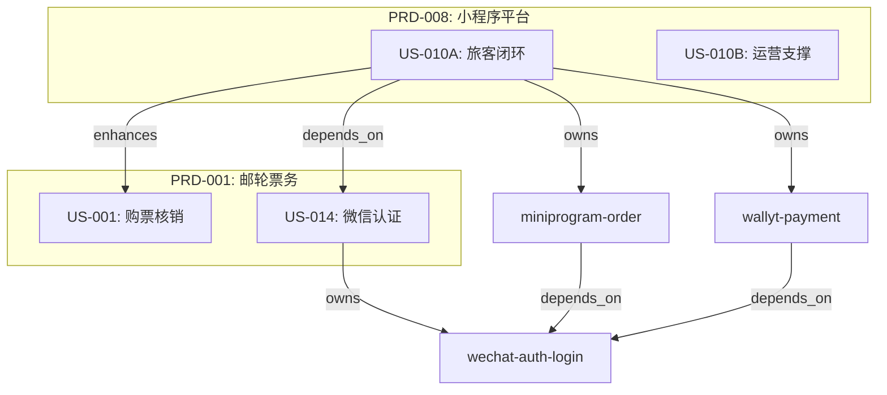

# PRD → Story → Card 文档规范

## 概述

本规范定义了产品文档的三层结构、各层职责、关系模型、模板格式和生命周期管理规则。

---

## 一、三层职责定义

### 总览

| 层级 | 核心问题 | 读者 | 视角 | 篇幅建议 |
|------|----------|------|------|----------|
| **PRD** | 为什么做？做什么？ | PM、老板、业务方 | 产品/商业 | 200-300行 |
| **Story** | 用户能做什么？怎么验收？ | PM、QA、业务方 | 用户（黑盒） | 100-200行 |
| **Card** | 技术上怎么实现？ | 开发、架构师 | 技术（白盒） | 200-400行 |

### PRD (Product Requirements Document)

**职责**：定义产品愿景、业务目标和成功指标

**PRD 定位**：

在本项目中，PRD 的定位是 **Epic/Feature Request**（需求级），而非产品模块级：

```
Category = 产品模块（core, customer, channel, operation, platform）
PRD      = 需求/Epic（一个完整的业务目标，1-3 个月可完成）
Story    = 用户能力（用户能做什么）
Card     = 技术实现（API 契约、数据结构）
```

**为什么这样定义**：
- 更灵活：按需求创建，不需要预先规划完整产品架构
- 更务实：中小团队常见做法，降低文档维护成本
- 有约束：通过 category 标签实现逻辑分组，避免混乱

**约束规则**：
1. **同 category 的 PRD 应共享 Card** - 避免重复实现相同功能
2. **新 PRD 前检查** - 同 category 是否已有相关 PRD，优先扩展已有 PRD
3. **合并触发** - 功能重叠 >50% 时必须合并（如 PRD-006 + PRD-007）
4. **粒度控制** - 一个 PRD 应能在 1-3 个月内完成，过大则拆分

**应该包含**：
- 需求背景（为什么要做）
- 解决方案概述（做什么）
- 成功指标（3-5个可量化KPI）
- 核心功能列表（仅名称+一句话描述）
- 业务规则摘要（关键规则）
- 风险与依赖
- 开放问题

**不应该包含**：
- ❌ 详细用户流程 → 放 Story
- ❌ Given/When/Then 验收标准 → 放 Story
- ❌ API 路径、数据结构 → 放 Card
- ❌ 实现细节、代码文件 → 放 Card

**Category 分类**（必填）：

每个 PRD 必须指定一个 category，用于标识其在产品架构中的位置：

| Category | 职责 | 典型功能 |
|----------|------|----------|
| `core` | 核心业务 | 购买、激活、预约、核销、库存、定价 |
| `customer` | 用户端 | 小程序、Web 预约、订单查询 |
| `channel` | 渠道 | OTA API、分销商、批量操作 |
| `operation` | 运营 | 场馆管理、操作员工具、报表 |
| `platform` | 平台 | 认证、多租户、通知服务 |

> 详见 [PRODUCT-ARCHITECTURE.md](./PRODUCT-ARCHITECTURE.md)

**新建 PRD 检查清单**：

新建 PRD 前，必须确认以下事项：

- [ ] 参考 [PRODUCT-ARCHITECTURE.md](./PRODUCT-ARCHITECTURE.md)，选择正确的 category
- [ ] 检查同 category 下是否已有相关 PRD，优先扩展已有 PRD
- [ ] 功能与已有 PRD 重叠度 < 30%
- [ ] 预估可在 1-3 个月内完成
- [ ] 明确与相邻 PRD 的边界

**规模建议**：

| 指标 | 建议值 | 警告值 |
|------|--------|--------|
| Stories 数量 | 3-8 | >15 需考虑拆分 |
| Cards 数量 | 5-20 | >30 需考虑拆分 |
| 完成周期 | 1-3 个月 | >6 个月需拆分 |

---

### Story (User Story)

**职责**：定义用户能力和业务验收标准

**应该包含**：
- 用户目标（一句话）
- 范围定义（in/out）
- 验收标准（Given/When/Then，用户视角）
- 业务规则（详细规则）
- 关联 Cards 列表

**不应该包含**：
- ❌ API 路径、HTTP 方法
- ❌ 数据库字段名
- ❌ 代码文件路径
- ❌ 错误码定义

**验收标准写法对比**：

```markdown
✅ 正确（用户视角）：
- Given 用户选择了商品和出行日期
- When 提交订单
- Then 看到订单确认页，显示15分钟支付倒计时

❌ 错误（技术细节）：
- When 调用 POST /orders
- Then 返回 201，reserved += quantity
```

---

### Card (Technical Card)

**职责**：定义技术实现契约和规范

**应该包含**：
- 前置条件
- API 契约（OAS 3.0.3 格式）
- 状态机/业务规则（技术实现角度）
- 数据影响（表、字段变更）
- 验收标准（Given/When/Then，技术视角）
- 实现文件路径
- 集成点
- 非功能需求（可选，高并发/性能敏感场景）

**验收标准写法**：

```markdown
✅ 正确（技术视角）：
- Given orders.status='pending'
- When POST /orders/:id/cancel
- Then 返回 200，product_inventory.reserved -= quantity

✅ 正确（边界情况）：
- Given 并发请求取消同一订单
- When 两个请求同时到达
- Then 只有一个成功，另一个返回 409 Conflict
```

---

## 二、关系模型

### 关系图

```
PRD (1) ──owns──> (N) Story ──owns──> (N) Card
                      │                   │
                      │ depends_on        │ depends_on
                      │ enhances          │
                      ↓                   ↓
                   Story               Card
```

### 关系类型定义

| 关系 | 方向 | 基数 | 含义 | 约束 |
|------|------|------|------|------|
| PRD → Story | owns | 1:N | PRD 拥有 Stories | Story 必须且仅属于一个 PRD |
| Story → Card | owns | 1:N | Story 拥有 Cards | Card 至少属于一个 Story |
| Story → Story | depends_on | N:N | 硬依赖 | 被依赖方废弃时必须处理 |
| Story → Story | enhances | N:N | 软扩展 | 被扩展方废弃时移除关联 |
| Card → Card | depends_on | N:N | 技术依赖 | 被依赖方废弃时必须处理 |

### 关系约束规则

```yaml
# Story 只能属于一个 PRD（单一归属）
Story:
  business_requirement: "PRD-008"  # 单值，必填

# Card 可被多个 Story 共享
Card:
  related_stories: ["US-010A", "US-014"]  # 多值，至少一个

# 依赖关系
Story:
  depends_on: ["US-014"]   # 硬依赖：被依赖方废弃时必须处理
  enhances: ["US-001"]     # 软扩展：被扩展方废弃时移除关联即可
```

### 可视化示例



---

## 三、文档模板

### PRD 模板

```markdown
# PRD-XXX: [产品名称]

## 元数据
​```yaml
prd_id: "PRD-XXX"
category: "core | customer | channel | operation | platform"  # 必填，产品架构分类
product_area: "[产品领域]"
owner: "[负责人]"
status: "Draft | In Progress | Done | Deprecated | On Hold"
created_date: "YYYY-MM-DD"
last_updated: "YYYY-MM-DD"
stories: ["US-XXX", "US-YYY"]  # 关联的 Stories
merged_into: ""  # 可选，废弃合并时指向目标 PRD
​```

## 变更日志
| 日期 | 变更 | 原因 | 操作人 |
|------|------|------|--------|
| YYYY-MM-DD | 创建 | 初始版本 | PM |

## 需求背景
[100字内，描述为什么要做，可以是问题、机会或战略需要]

## 解决方案概述
[100字内，描述解决方案]

## 成功指标
| 指标 | 目标值 | 衡量方式 |
|------|--------|----------|
| [指标1] | [目标] | [如何衡量] |

## 核心功能
| 功能 | 描述 | 关联Story |
|------|------|-----------|
| [功能1] | [一句话描述] | US-XXX |

## 业务规则摘要
- [关键规则1]
- [关键规则2]

## 风险与依赖
### 依赖
- [依赖1]

### 风险
| 风险 | 影响 | 缓解措施 |
|------|------|----------|
| [风险1] | [影响] | [措施] |

## 开放问题
- [ ] [问题1]
- [ ] [问题2]
```

---

### Story 模板

```markdown
---
id: US-XXX
title: "[用户能力描述]"
owner: "[负责人]"
status: "Draft | In Progress | Done | Deprecated | On Hold"
priority: "High | Medium | Low"
created_date: "YYYY-MM-DD"
last_updated: "YYYY-MM-DD"
business_requirement: "PRD-XXX"
depends_on: []      # 硬依赖的 Stories
enhances: []        # 软扩展的 Stories
cards: []           # 拥有的 Cards
---

## 变更日志
| 日期 | 变更 | 原因 |
|------|------|------|
| YYYY-MM-DD | 创建 | 初始版本 |

## 用户目标
[一句话描述用户能做什么，获得什么价值]

## 范围

### 包含 (In Scope)
- [功能1]
- [功能2]

### 不包含 (Out of Scope)
- [排除项1]
- [排除项2]

## 验收标准

### A. [场景名称]
- **Given** [前置条件，用户视角]
- **When** [用户操作]
- **Then** [期望结果，用户可感知的]

### B. [场景名称]
- **Given** [前置条件]
- **When** [用户操作]
- **Then** [期望结果]

## 业务规则
1. [详细业务规则1]
2. [详细业务规则2]

## 关联 Cards
| Card | 状态 | 描述 |
|------|------|------|
| [card-slug] | [状态] | [一句话描述] |
```

---

### Card 模板

```markdown
---
card: "[Card 名称]"
slug: "[card-slug]"
team: "[负责团队]"
status: "Draft | In Progress | Done | Deprecated | On Hold"
readiness: "design | dev | mvp | production"
created_date: "YYYY-MM-DD"
last_updated: "YYYY-MM-DD"
related_stories: ["US-XXX"]
depends_on: []           # 依赖的其他 Cards
oas_paths: []            # API 路径
migrations: []           # 数据库迁移文件
---

## 变更日志
| 日期 | 变更 | 原因 |
|------|------|------|
| YYYY-MM-DD | 创建 | 初始版本 |

## 前置条件
- [前置条件1]
- [前置条件2]

## API 序列图
​```mermaid
sequenceDiagram
    actor User
    participant API
    participant Service
    participant DB

    User->>API: [请求]
    API->>Service: [调用]
    Service->>DB: [操作]
    DB-->>Service: [返回]
    Service-->>API: [响应]
    API-->>User: [结果]
​```

## API 契约 (OAS 3.0.3)
​```yaml
paths:
  /api/path:
    post:
      summary: [描述]
      requestBody:
        content:
          application/json:
            schema:
              type: object
              properties:
                field1:
                  type: string
      responses:
        "200":
          description: 成功
​```

## 业务规则
| 规则 | 描述 |
|------|------|
| [规则1] | [描述] |

## 数据影响
| 表 | 操作 | 说明 |
|-----|------|------|
| [表名] | INSERT/UPDATE/DELETE | [说明] |

## 验收标准 (技术视角)

### 正常流程
- **Given** [技术前置条件]
- **When** [API 调用]
- **Then** [技术结果，包含状态码、数据变更]

### 异常流程
- **Given** [异常条件]
- **When** [API 调用]
- **Then** [错误响应]

### 边界情况
- **Given** [边界条件，如并发]
- **When** [操作]
- **Then** [预期行为]

## 实现文件
​```
src/modules/xxx/
├── router.ts
├── service.ts
└── types.ts
​```

## 集成点
- **[依赖Card]** - [集成说明]

## 非功能需求 (可选)

### Scalability
| 指标 | 目标值 | 说明 |
|------|--------|------|
| 预期 QPS | [X] req/s | [日常负载] |
| 峰值 QPS | [Y] req/s | [峰值场景，如促销] |
| 响应时间 P99 | [Z] ms | [性能目标] |

### 扩展策略
- 水平扩展：[是否支持，如何扩展]
- 数据分片：[是否需要，策略]
- 缓存策略：[缓存层，TTL]

> 注：此 section 为可选，仅在高并发或性能敏感场景需要填写
```

---

## 四、状态与生命周期

### 状态定义

| 状态 | 含义 | 可转换到 |
|------|------|----------|
| `Draft` | 草稿，未开始 | In Progress, Deprecated |
| `In Progress` | 开发中 | Done, On Hold, Deprecated |
| `Done` | 已完成 | Deprecated |
| `On Hold` | 暂停（可能恢复） | In Progress, Deprecated |
| `Deprecated` | 废弃（不再需要） | - (终态) |

### 状态流转图

```
Draft ──────────────────────────────────────> Deprecated
  │                                               ↑
  ↓                                               │
In Progress ──> Done ─────────────────────────────┤
  │               │                               │
  ↓               │                               │
On Hold ──────────┴───────────────────────────────┘
```

### 废弃处理

当标记废弃时，必须记录：

```yaml
status: "Deprecated"
deprecated_at: "YYYY-MM-DD"
deprecated_reason: "[废弃原因]"
deprecated_by: "[操作人]"
superseded_by: "[替代文档，如有]"  # 可选
```

### 废弃文档存放

废弃的文档应移动到对应目录的 `_deprecated/` 子目录：

```
docs/prd/_deprecated/           # 废弃的 PRD
docs/stories/_deprecated/       # 废弃的 Story
docs/cards/_deprecated/         # 废弃的 Card
```

**规则**：
1. 文件保留原名，便于追溯
2. 每个 `_deprecated/` 目录应有 README.md 记录废弃清单
3. 废弃文档不删除，作为历史记录保留

---

## 五、废弃级联规则

### PRD 废弃

```
PRD 废弃
└── 检查所有 owned Stories
    ├── 转移到其他 PRD → 更新 Story.business_requirement
    └── 不再需要 → 标记 Story 废弃 → 触发 Story 废弃流程
```

### Story 废弃

```
Story 废弃
├── 检查 depends_on 此 Story 的其他 Stories
│   └── 必须处理（废弃 或 找替代 或 移除依赖）
│
├── 检查 enhances 此 Story 的其他 Stories
│   └── 移除 enhances 关联即可
│
└── 检查 owned Cards
    ├── 仅被此 Story 使用 → 标记 Card 废弃
    └── 被多个 Stories 使用 → 保留，移除此 Story 关联
```

### Card 废弃

```
Card 废弃
├── 检查 depends_on 此 Card 的其他 Cards
│   └── 必须处理（废弃 或 找替代）
│
└── 代码处理
    ├── 已上线 → 保留代码，标记 @deprecated
    └── 未上线 → 可删除代码和迁移文件
```

### 处理流程

```
1. 决定废弃
   ↓
2. 更新文档状态 + 记录原因
   ↓
3. 检查级联影响（按上述规则）
   ↓
4. 处理依赖方
   ↓
5. 通知相关人员
   ↓
6. 代码处理（如需要）
   ↓
7. 运行 npm run validate:docs 验证一致性
```

---

## 六、校验规则

### 归属完整性
- [ ] 每个 Story 都有 `business_requirement` 指向存在的 PRD
- [ ] 每个 Card 都有 `related_stories` 指向存在的 Story
- [ ] PRD.stories 与 Story.business_requirement 双向一致

### 依赖有效性
- [ ] Story.depends_on 指向的 Story 存在且未废弃
- [ ] Story.enhances 指向的 Story 存在
- [ ] Card.depends_on 指向的 Card 存在且未废弃

### 状态一致性
- [ ] Deprecated PRD 的所有 Stories 已处理
- [ ] Deprecated Story 的所有 Cards 已处理
- [ ] Deprecated Story 的依赖方已处理

### 孤儿检测
- [ ] 无 Story 引用的 Card → 警告
- [ ] 无 PRD 引用的 Story → 错误
- [ ] Card.related_stories 中有已废弃的 Story → 警告

### 校验命令

```bash
npm run validate:docs
```

校验脚本应输出：
```
✓ PRD-001: 3 stories, all valid
✓ PRD-008: 2 stories, all valid
✗ US-010B: depends_on US-099 not found
✗ miniprogram-order: related_story US-999 not found
⚠ travel-search-hub: no active story references (deprecated?)
```

---

## 七、常见错误

| 错误 | 应该在 | 不应该在 |
|------|--------|----------|
| `POST /orders` | Card | Story / PRD |
| `lockExpireAt` 字段 | Card | Story / PRD |
| "15分钟超时自动取消" | Story + Card | 仅 PRD |
| "GMV目标30%" | PRD | Story / Card |
| Given/When/Then | Story + Card | PRD |
| 用户场景故事 | Story | PRD（仅摘要）|
| API 错误码 | Card | Story |
| 数据库表结构 | Card | Story / PRD |

---

## 八、快速参考

### 创建新功能

```
1. 判断层级（参考 DOCUMENT-LAYER-DECISION.md）
2. 创建/更新 PRD（如果是新产品域）
3. 创建 Story（定义用户能力和验收标准）
4. 创建 Card（定义技术实现）
5. 更新关联关系
6. 运行 npm run validate:docs
```

### 废弃功能

```
1. 标记文档状态为 Deprecated
2. 记录废弃原因和日期
3. 检查级联影响
4. 处理依赖方
5. 处理代码（如需要）
6. 运行 npm run validate:docs
```

### 查询关系

```bash
# 查看 PRD 的所有 Stories
grep -l "business_requirement: \"PRD-008\"" docs/stories/*.md

# 查看 Story 的所有 Cards
grep -l "related_stories:.*US-010A" docs/cards/*.md

# 查看废弃的文档（已移动到 _deprecated 目录）
ls docs/prd/_deprecated/ docs/stories/_deprecated/ docs/cards/_deprecated/ 2>/dev/null
```

---

## 九、变更历史规范 (Delta 格式)

### 目标

标准化 Card 变更记录，使用结构化的 ADDED/MODIFIED/REMOVED 格式，便于追踪 API 演进和回顾变更。

### Delta 格式定义

| 类型 | 含义 | 典型内容 |
|------|------|----------|
| **ADDED** | 新增内容 | 新 API 端点、新请求/响应字段、新业务规则 |
| **MODIFIED** | 修改内容 | 字段类型变更、验证规则调整、行为变化 |
| **REMOVED** | 移除内容 | 废弃的字段、删除的端点、移除的规则 |

### Card Frontmatter 扩展

在 Card 的 frontmatter 中添加 `changelog` 字段：

```yaml
---
card: "Order create API"
slug: order-create
status: "Done"
last_update: "2025-12-24T10:00:00+08:00"

changelog:
  - version: "1.2.0"
    date: "2025-12-24"
    summary: "添加订单取消功能"
    breaking: false
    delta:
      added:
        - "POST /orders/:id/cancel 端点"
        - "cancel_reason 请求字段"
        - "cancelled 订单状态"
      modified:
        - "订单状态流转规则：已支付订单可取消"
      removed: []

  - version: "1.1.0"
    date: "2025-12-01"
    summary: "支持复杂定价"
    breaking: false
    delta:
      added:
        - "pricing_context 请求字段"
        - "pricing_breakdown 响应字段"
      modified: []
      removed: []

  - version: "1.0.0"
    date: "2025-10-26"
    summary: "初始版本"
    breaking: false
    delta:
      added:
        - "POST /orders 端点"
        - "基础订单创建功能"
      modified: []
      removed: []
---
```

### Changelog 字段说明

| 字段 | 类型 | 必填 | 说明 |
|------|------|------|------|
| `version` | string | 是 | 语义化版本号 (SemVer) |
| `date` | string | 是 | 变更日期 (YYYY-MM-DD) |
| `summary` | string | 是 | 变更摘要 (一句话) |
| `breaking` | boolean | 否 | 是否是破坏性变更，默认 false |
| `delta.added` | string[] | 否 | 新增内容列表 |
| `delta.modified` | string[] | 否 | 修改内容列表 |
| `delta.removed` | string[] | 否 | 移除内容列表 |

### 版本号规则 (SemVer)

| 类型 | 版本变更 | 示例场景 |
|------|----------|----------|
| **Major (X.0.0)** | Breaking change | 移除必填字段、变更 API 路径、不兼容的响应格式 |
| **Minor (0.X.0)** | 新增功能（向后兼容） | 新增可选字段、新增端点、新增业务规则 |
| **Patch (0.0.X)** | Bug 修复、文档更新 | 修复计算错误、更新描述、优化性能 |

### Markdown Changelog 章节（可选）

除了 frontmatter，可在 Card 正文添加人类可读的变更日志：

```markdown
## Changelog

### v1.2.0 (2025-12-24) - 订单取消功能

**ADDED:**
- POST /orders/:id/cancel 端点
- `cancel_reason` 请求字段：取消原因
- `cancelled` 订单状态

**MODIFIED:**
- 订单状态流转规则：已支付订单在发货前可取消

---

### v1.1.0 (2025-12-01) - 复杂定价支持

**ADDED:**
- `pricing_context` 请求字段：支持多变量定价
- `pricing_breakdown` 响应字段：详细价格分解
```

### 何时记录变更

| 场景 | 是否记录 | 说明 |
|------|---------|------|
| 新增 API 端点 | ✅ 是 | version +0.1.0 |
| 新增可选字段 | ✅ 是 | version +0.1.0 |
| 修改字段类型 | ✅ 是 | version +1.0.0 (breaking) |
| 修复 bug | ⚠️ 视情况 | 如影响行为则记录 |
| 更新文档描述 | ❌ 通常不需要 | 除非是重要澄清 |
| 重构代码（无行为变化） | ❌ 否 | 不影响 API 契约 |

### 工作流集成

在 AI 工作流 Step 2 (Execute) 中，修改现有 Card 时：

1. 更新 `last_update` 字段
2. 在 `changelog` 数组开头添加新版本记录
3. 使用 ADDED/MODIFIED/REMOVED 结构描述变更
4. 根据变更类型确定版本号

### 示例：Breaking Change

```yaml
changelog:
  - version: "2.0.0"
    date: "2025-12-24"
    summary: "channel_id 重命名为 partner_id"
    breaking: true
    delta:
      added:
        - "partner_id 字段 (string)"
      modified:
        - "订单归属逻辑：从渠道改为合作伙伴"
      removed:
        - "channel_id 字段 (已废弃，将在 2026-03 移除)"
```

---

## 相关文档

- [DOCUMENT-LAYER-DECISION.md](DOCUMENT-LAYER-DECISION.md) - 文档层级决策树
- [NATURAL-LANGUAGE-OPTIMIZATION.md](NATURAL-LANGUAGE-OPTIMIZATION.md) - 自然语言需求优化
- [API-CHANGE-MANAGEMENT.md](API-CHANGE-MANAGEMENT.md) - API 变更管理
