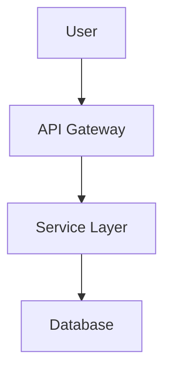

# Documentation Visualization Site

**Status:** ✅ Production Ready
**Created:** 2025-11-29
**Purpose:** Web-based visualization of PRDs, Stories, and Cards for Product Management

---

## Overview

The documentation visualization site provides a PM-friendly web interface to browse and understand the complete project structure without accessing source code. It dynamically loads all markdown files and exposes their relationships through an intuitive navigation system.

### Key Principle: Zero Hardcoding

Everything is **dynamically discovered at runtime**:
- PRD files scanned from `docs/prd/*.md`
- Stories loaded from `docs/stories/_index.yaml` and `docs/stories/*.md`
- Cards discovered from `docs/cards/*.md`
- Relationships extracted from YAML frontmatter metadata

**No manual updates required** - just add/edit markdown files and the site reflects changes immediately.

---

## Available Routes

### 1. Documentation Hub - `/project-docs`

**Landing page** with navigation cards and overview statistics.

**What it shows:**
- Quick access to all documentation sections
- Real-time counts: Total PRDs, Stories, Cards
- Test coverage percentage
- Status distribution

**Use case:** Starting point for PM to explore project documentation

---

### 2. PRD Browser - `/prd`

**Lists all Product Requirements Documents** with metadata and related stories.

**What it shows:**
- PRD ID, title, status (Draft/Implemented/Production Ready)
- Product area, creation date, owner
- Related user stories (clickable links)
- Click any PRD to view full details

**Data source:**
- Files: `docs/prd/*.md`
- Metadata: YAML frontmatter (`prd_id`, `status`, `related_stories`)

**Use case:** Browse high-level product requirements

**Example:**
```
📋 PRD-001: Cruise Ticketing Platform [Production Ready]
  Area: Commerce | Created: 2025-10-15
  Related Stories: US-001, US-003, US-007, US-011
```

---

### 3. Individual PRD View - `/prd/:prdId`

**Full details of a specific PRD** with markdown content rendered as HTML.

**What it shows:**
- Complete PRD content (objectives, features, acceptance criteria)
- All metadata (status, owner, deadlines)
- Related stories with direct links
- Link back to PRD browser

**URL patterns:**
- `/prd/PRD-001` or `/prd/001` (both work)

**Use case:** Deep dive into specific product requirements

---

### 4. Stories Browser - `/stories`

**Lists all User Stories** with their status and parent PRD.

**What it shows:**
- Story ID, title, status (Approved/Draft/Done)
- Parent PRD (business requirement)
- Click any story to view full details

**Data source:**
- Primary: `docs/stories/_index.yaml`
- Fallback: `docs/stories/US-*.md` (individual files)
- Relationships: `business_requirement` field links to PRD

**Use case:** Browse all user stories across all PRDs

**Example:**
```
📖 US-001: Buy package and redeem via QR [Approved]
  PRD: PRD-001

📖 US-012: OTA platform integration [Done]
  PRD: PRD-002
```

---

### 5. Individual Story View - `/stories/:storyId`

**Full details of a specific user story** (redirects to `/prd/story/:storyId`).

**What it shows:**
- Complete story content (user journey, acceptance criteria)
- Metadata (status, creation date, deadline)
- Parent PRD (business requirement) with link
- Related cards (if referenced in metadata)

**URL patterns:**
- `/stories/US-001` or `/stories/001` (both work)

**Use case:** Understand specific user story requirements

---

### 6. Cards Browser - `/cards`

**Lists all Implementation Cards** with status, team, and related stories.

**What it shows:**
- Card title, slug, status (Done/Ready/In Progress/Deprecated)
- Team assignment (A - Commerce, B - Tickets, C - Operations)
- API endpoints (from `oas_paths`)
- Related stories (clickable links)
- Status statistics (X Done, Y In Progress, etc.)

**Data source:**
- Files: `docs/cards/*.md`
- Metadata: YAML frontmatter (`slug`, `status`, `team`, `related_stories`)

**Use case:** Browse all technical implementation cards

**Example:**
```
🎯 Catalog endpoint (real) [Done]
  Team: A - Commerce
  Slug: catalog-endpoint
  API: /catalog
  Related Stories: US-001
```

---

### 7. Individual Card View - `/cards/:cardSlug`

**Full details of a specific implementation card** with markdown content.

**What it shows:**
- Complete card content (purpose, contract, rules, tests)
- Metadata (status, team, API paths, last update)
- Related stories with links (bidirectional navigation)
- Link back to cards browser

**URL example:**
- `/cards/catalog-endpoint`

**Use case:** Deep dive into technical implementation details

---

### 8. Sitemap - `/sitemap`

**Hierarchical tree view** showing PRD → Story → Card relationships.

**What it shows:**
- Collapsible tree structure
- All three layers in one view
- Status badges at each level
- Click any item to navigate to details

**Data source:**
- Built dynamically using `sitemapBuilder.ts`
- Relationships from YAML frontmatter across all files

**Use case:** Understand complete project hierarchy at a glance

**Example structure:**
```
📋 PRD-001: Cruise Ticketing Platform [Implemented]
  ├─ 📖 US-001: Buy package & redeem [Approved]
  │   ├─ 🎯 catalog-endpoint [Done]
  │   ├─ 🎯 order-create [Done]
  │   └─ 🎯 payment-webhook [Done]
  ├─ 📖 US-011: Complex pricing [Approved]
  │   └─ 🎯 complex-pricing-engine [Done]
```

---

### 9. Compliance Dashboard - `/compliance` ⭐ NEW

**Real-time documentation compliance audit** with self-healing suggestions.

**What it shows:**
- Overall compliance score (0-100%)
- Critical issues (errors) vs warnings
- Total files audited (PRDs, Stories, Cards)
- **Quick Wins** - Prioritized fixes for maximum impact
- Detailed violations table with:
  - File path
  - Issue description
  - Exact fix needed
  - Impact explanation

**Data source:**
- **100% Dynamic** - Scans all documentation files in real-time
- No hardcoded data - runs `complianceAuditor.ts` on every request
- Validates against rules in this document

**Use case:** Self-service documentation quality control for developers

**Features:**
- ✅ Auto-detects violations (status values, missing fields, broken relationships)
- ✅ Provides actionable fix suggestions
- ✅ Explains impact of each violation
- ✅ Prioritizes "quick wins" for bulk fixes
- ✅ Updates instantly when documentation changes

**Example violations detected:**
```
❌ ERROR | Story Status | docs/stories/_index.yaml (US-001)
  Issue: Invalid status: "Approved"
  Fix: Change status to one of: Draft, In Progress, Done
  Impact: Status filters will not work correctly

❌ ERROR | Missing Field | docs/cards/catalog-endpoint.md
  Issue: Missing related_stories field
  Fix: Add related_stories: ["US-001"] to frontmatter
  Impact: Card appears orphaned, bidirectional navigation broken

⚠️ WARNING | PRD Status | docs/prd/PRD-001-cruise-ticketing.md
  Issue: Invalid status: "Implemented"
  Fix: Change status to one of: Draft, In Progress, Done
  Impact: Status filters and dashboards may not recognize this PRD
```

**Self-Healing Workflow:**
1. Developer makes documentation changes
2. Visits `/compliance` to check impact
3. Sees specific violations with exact fixes
4. Applies suggested fixes
5. Refreshes dashboard to verify (score improves instantly)

**AI as a Story-Telling Guide:**

The compliance dashboard doesn't just report errors - it **tells the story** of what's wrong and guides you to the solution:

- **Understands Context**: "PRD-003 links to US-001, but US-001 links to PRD-001" (explains the relationship mismatch)
- **Provides Guidance**: "Remove 'US-001' from related_stories in PRD-003" (specific fix, not just "error")
- **Explains Impact**: "Story won't appear under this PRD on sitemap" (helps you understand why it matters)
- **Adapts in Real-Time**: Score improves from -28% → -26% instantly when you fix one violation

This creates an **intelligent learning loop** where the AI helps you understand the documentation rules rather than just enforcing them.

**Developer Workflow Integration:**

The compliance dashboard integrates seamlessly into your development workflow:

1. **During Development**: Create docs alongside code, check `/compliance` before committing
2. **Code Review**: Reviewer can verify compliance score is acceptable (e.g., >80%)
3. **Onboarding**: New developers learn documentation standards through immediate feedback
4. **Refactoring**: When reorganizing docs, instantly see what breaks and how to fix it
5. **Quality Gates**: Can be integrated into CI/CD to enforce documentation standards

**Example workflow:**
```bash
# 1. Create feature branch
git checkout -b feat/loyalty-program

# 2. Write docs (PRD, stories, cards)
vim docs/prd/PRD-009-loyalty-program.md
vim docs/stories/_index.yaml
vim docs/cards/loyalty-points-earn.md

# 3. Implement code
vim src/modules/loyalty/...

# 4. Check compliance BEFORE committing
open http://localhost:8080/compliance
# See: Score 75% - need bidirectional links

# 5. Fix violations
# Add related_stories fields, update PRD links

# 6. Re-check compliance
# Score: 100% ✅

# 7. Commit with confidence
git add . && git commit -m "Add loyalty program with full docs"
```

**Benefits:**
- Documentation becomes part of development, not an afterthought
- Quality is enforced automatically, not manually
- Developers learn through use, not reading manuals
- Compliance is measurable (score goes from -26% → 0% → 80%)
- Trust in documentation increases because it's always validated

---

### 10. Test Coverage - `/coverage`

**Test coverage metrics** from Newman test reports.

**What it shows:**
- Coverage statistics per PRD
- Total requests, assertions, pass rate
- Test collection filenames
- Visual status indicators (Complete/Partial/Draft)

**Data source:**
- File: `docs/test-coverage/_index.yaml`
- Fields: `test_statistics`, `coverage_analysis`

**Use case:** Track testing progress and quality metrics

**Example:**
```
PRD-006 | Ticket Activation System | ✅ Complete (100%)
  Requests: 23 | Assertions: 46 | Pass Rate: 100%
  Collection: prd-006-ticket-activation.json
```

---

### 11. Relationship Graph - `/graph`

**Interactive visual graph** showing PRD → Story → Card connections.

**What it shows:**
- All PRDs, Stories, Cards as clickable nodes
- Visual connections showing relationships
- Color-coded by type (PRD=blue, Story=green, Card=red)
- Interactive click to highlight connected nodes
- Filter by PRD dropdown

**Data source:**
- Built dynamically using `sitemapBuilder.ts`
- Relationships from YAML frontmatter across all files

**Use case:** Visual exploration of project structure and dependencies

---

### 12. Product Architecture - `/architecture` ⭐ NEW

**Visual architecture diagram** with Mermaid flowchart rendering.

**What it shows:**
- Product architecture flowchart
- System component relationships
- Data flow between modules
- Interactive Mermaid diagrams (pan, zoom)

**Data source:**
- File: `docs/product-architecture-flowchart.md`
- Renders Mermaid code blocks as interactive diagrams
- Uses Mermaid.js CDN for client-side rendering

**Use case:** Understand system architecture and component relationships at a glance

**Features:**
- ✅ Mermaid diagram support (flowcharts, sequence diagrams, etc.)
- ✅ Automatic code block detection and rendering
- ✅ Styled markdown content alongside diagrams
- ✅ Navigation bar consistent with other pages

**Example Mermaid block:**
```markdown

```

---

## Architecture

### Parser Utilities (Zero Hardcoding)

#### 1. `src/utils/prdParser.ts` (Existing)

**Responsibilities:**
- Scan `docs/prd/` directory for `.md` files
- Parse YAML frontmatter (supports 3 formats: code block, standard, simple)
- Load stories index from `docs/stories/_index.yaml`
- Build PRD → Story relationships

**Key functions:**
```typescript
loadPRDDocuments(): PRDDocument[]        // Scans prd/*.md
loadStoriesIndex(): StoryInfo[]          // Loads _index.yaml
getRelatedStories(prdId, stories)        // Find stories for PRD
getStoryById(storyId)                    // Load individual story
```

**Relationship logic:**
- **Primary:** Match stories where `business_requirement === prdId`
- **Fallback:** Match stories in PRD's `related_stories[]` array

---

#### 2. `src/utils/cardParser.ts` (New)

**Responsibilities:**
- Scan `docs/cards/` directory for `.md` files
- Parse YAML frontmatter (standard `---` format)
- Extract card metadata (slug, status, team, related_stories)
- Provide card lookup and filtering functions

**Key functions:**
```typescript
loadCardDocuments(): CardDocument[]      // Scans cards/*.md
getCardBySlug(slug): CardDocument        // Find specific card
getCardsForStory(storyId)                // Find cards for story
getCardStats()                           // Count by status/team
```

**Metadata fields:**
```yaml
slug: "catalog-endpoint"
status: "Done"
team: "A - Commerce"
oas_paths: ["/catalog"]
related_stories: ["US-001"]
last_update: "2025-10-19T22:21:00+0800"
```

---

#### 3. `src/utils/coverageParser.ts` (New)

**Responsibilities:**
- Load test coverage data from `docs/test-coverage/_index.yaml`
- Parse coverage registry and statistics
- Calculate coverage metrics

**Key functions:**
```typescript
loadTestCoverageData(): TestCoverageData  // Load YAML file
getCoverageForPRD(prdId)                  // Get PRD coverage
getCoverageStats()                        // Calculate metrics
```

**Data structure:**
```yaml
coverage_registry:
  - prd_id: PRD-006
    test_statistics:
      total_requests: 23
      total_assertions: 46
      passed_assertions: 46
```

---

#### 4. `src/utils/complianceAuditor.ts` (New)

**Responsibilities:**
- Audit all PRDs, Stories, and Cards for compliance violations
- Validate status values against allowed values per document type
- Check bidirectional relationship consistency (PRD ↔ Story ↔ Card)
- Detect missing required fields in YAML frontmatter
- Generate actionable fix suggestions with impact explanations

**Key functions:**
```typescript
runComplianceAudit(): ComplianceReport     // Full audit of all docs
```

**Interfaces:**
```typescript
interface ComplianceViolation {
  type: 'error' | 'warning';
  category: string;
  file: string;
  issue: string;
  fix: string;
  impact: string;
}

interface ComplianceReport {
  violations: ComplianceViolation[];
  stats: {
    totalFiles: number;
    errors: number;
    warnings: number;
    score: number;
  };
}
```

**Validation rules:**
- PRD status: `Draft`, `In Progress`, `Done`
- Story status: `Draft`, `In Progress`, `Done`
- Card status: `Ready`, `In Progress`, `Done`
- Bidirectional: If PRD claims story, story must claim PRD back
- Required fields per document type (see "Developer Maintenance Requirements")

---

#### 5. `src/utils/sitemapBuilder.ts` (New)

**Responsibilities:**
- Build hierarchical PRD → Story → Card tree
- Use existing parsers to load all data
- Resolve relationships bidirectionally
- Provide reverse lookup utilities

**Key functions:**
```typescript
buildSitemap(): SitemapPRD[]              // Build full tree
findStoriesUsingCard(cardSlug)            // Reverse: Card → Stories
findPRDForStory(storyId)                  // Reverse: Story → PRD
getSitemapStats()                         // Count totals
```

**Relationship resolution:**
1. Load all PRDs, Stories, Cards
2. For each PRD:
   - Find stories via `business_requirement` or `related_stories`
3. For each Story:
   - Find cards via `cards[]` array or `related_stories` field
4. Build nested structure dynamically

---

### Route Handlers (in `src/app.ts`)

All routes use **HTML generation** with:
- Consistent styling and navigation
- Markdown-to-HTML conversion
- Dynamic data loading (no caching)
- Error handling with user-friendly messages

**Common pattern:**
```typescript
this.app.get('/route', (req, res) => {
  try {
    // 1. Load data dynamically
    const data = loadSomeDocuments();

    // 2. Build HTML with styling
    let html = `<!DOCTYPE html>...`;

    // 3. Iterate and render
    data.forEach(item => {
      html += `<div>${item.title}</div>`;
    });

    // 4. Send response
    res.setHeader('Content-Type', 'text/html');
    res.send(html);
  } catch (error) {
    logger.error('Error:', error);
    res.status(500).json({ error: 'Message' });
  }
});
```

---

## Relationship Mapping

### How Relationships Are Discovered

#### PRD → Stories

**Method 1 (Primary):** Stories declare their parent PRD
```yaml
# In docs/stories/_index.yaml or US-*.md
- id: US-001
  business_requirement: "PRD-001"  # ← Links to PRD
```

**Method 2 (Fallback):** PRDs declare their stories
```yaml
# In docs/prd/PRD-001-*.md
prd_id: "PRD-001"
related_stories: ["US-001", "US-003"]  # ← Links to Stories
```

**Implementation:** `getRelatedStories()` tries both methods

---

#### Stories → Cards

**Method 1:** Stories declare their cards
```yaml
# In docs/stories/_index.yaml
- id: US-001
  cards: ["catalog-endpoint", "order-create"]  # ← Card slugs
```

**Method 2:** Cards declare their stories
```yaml
# In docs/cards/catalog-endpoint.md
slug: "catalog-endpoint"
related_stories: ["US-001"]  # ← Story IDs
```

**Implementation:** `buildSitemap()` merges both sources

---

#### Reverse Lookups

**Card → Stories:**
```typescript
findStoriesUsingCard("catalog-endpoint")
// Returns: [US-001, US-003]
```

**Story → PRD:**
```typescript
findPRDForStory("US-001")
// Returns: PRD-001 document
```

---

## Navigation Flow

### Typical PM Journey

1. **Start:** Visit `/project-docs`
   - See overview: 8 PRDs, 18 Stories, 45 Cards
   - Click "PRDs" to explore

2. **Browse PRDs:** Visit `/prd`
   - See PRD-001: Cruise Ticketing Platform
   - Click to view details

3. **View PRD Details:** Visit `/prd/PRD-001`
   - Read full requirements
   - See related stories: US-001, US-003, US-011
   - Click US-001

4. **View Story Details:** Visit `/stories/US-001`
   - Read user story
   - See parent: PRD-001
   - See cards: catalog-endpoint, order-create
   - Click catalog-endpoint

5. **View Card Details:** Visit `/cards/catalog-endpoint`
   - Read technical spec
   - See API: GET /catalog
   - See status: Done
   - Navigate back or to related stories

6. **Check Progress:** Visit `/sitemap`
   - See complete hierarchy
   - Understand how everything connects

7. **Verify Quality:** Visit `/coverage`
   - Check test coverage: 100% for PRD-001
   - Verify all assertions passing

---

## Styling & UX

### Design Principles

1. **Clean & Professional:** Minimal, Apple-inspired design
2. **Responsive:** Works on desktop and mobile
3. **Consistent:** Same navigation on all pages
4. **Accessible:** Clear hierarchy, readable fonts, color-coded status

### Visual Elements

**Status Badges:**
- ✅ Done (green)
- 🔵 Ready (blue)
- ⚠️ In Progress (yellow)
- ❌ Deprecated (red)
- ⚪ Draft (gray)

**Navigation Bar:** (On all pages)
```
[← Project Docs] [PRDs] [Stories] [Cards] [Sitemap] [Coverage]
```

**Icons:**
- 📋 PRD
- 📖 Story
- 🎯 Card
- 🗺️ Sitemap
- 📊 Coverage
- 🔧 API Docs

---

## Data Freshness

### Real-Time Updates

**All data loaded on every request** - no caching:
- Add new PRD → Appears in `/prd` immediately
- Update story status → Reflects in `/stories` immediately
- Add card → Shows in `/cards` immediately
- Change relationships → Sitemap updates immediately

**No restart required** - just refresh the browser.

---

## File Structure

```
docs/
├── prd/                           # PRD markdown files
│   ├── PRD-001-*.md
│   ├── PRD-002-*.md
│   └── ...
├── stories/
│   ├── _index.yaml               # Stories registry
│   ├── US-001-*.md
│   ├── US-012-*.md
│   └── ...
├── cards/
│   ├── catalog-endpoint.md
│   ├── order-create.md
│   └── ...
├── test-coverage/
│   └── _index.yaml               # Coverage data
├── reference/
│   └── DOCUMENTATION-SITE.md     # This file
└── product-architecture-flowchart.md  # Architecture diagram (Mermaid)

src/
├── modules/
│   └── docs/
│       └── router.ts             # Documentation route handlers
├── utils/
│   ├── prdParser.ts              # PRD & Story loader
│   ├── cardParser.ts             # Card loader
│   ├── coverageParser.ts         # Coverage loader
│   ├── sitemapBuilder.ts         # Hierarchy builder
│   ├── complianceAuditor.ts      # Compliance audit engine
│   └── markdown.ts               # Markdown to HTML converter
└── app.ts                         # Main application
```

---

## Usage Examples

### For Product Managers

**Scenario 1: Check project status**
```
1. Visit /project-docs
2. See: 7/8 PRDs implemented (88%)
3. Click "Test Coverage"
4. Verify: 95% overall coverage
```

**Scenario 2: Understand a feature**
```
1. Visit /prd
2. Click "PRD-002: OTA Platform Integration"
3. Read full requirements
4. Click "US-012: OTA integration"
5. See implementation cards
6. Click card to view technical details
```

**Scenario 3: Plan next sprint**
```
1. Visit /sitemap
2. Expand PRD-005 (Reseller Billing)
3. See status: Draft
4. Check which stories are Ready
5. Click story to understand scope
```

---

### For Developers

**Scenario 1: Find card to implement**
```
1. Visit /cards
2. Filter by status: "Ready"
3. Click card to read spec
4. See related stories for context
5. Click story to understand business requirement
```

**Scenario 2: Add new card**
```
1. Create docs/cards/new-feature.md
2. Add YAML frontmatter:
   slug: new-feature
   status: Ready
   related_stories: [US-015]
3. Refresh /cards
4. New card appears automatically
```

**Scenario 3: Verify test coverage**
```
1. Visit /coverage
2. Find your PRD
3. Check assertions count
4. Verify 100% pass rate
```

---

## Troubleshooting

### Common Issues

**Issue:** Card not appearing in `/cards`

**Solutions:**
- Check filename ends with `.md`
- Verify YAML frontmatter is valid
- Ensure `slug` field is present
- Refresh browser (no caching)

---

**Issue:** Story not linked to PRD

**Solutions:**
- Check `business_requirement: "PRD-XXX"` in story metadata
- OR add story ID to PRD's `related_stories: []` array
- Verify PRD ID format (PRD-001 vs 001)

---

**Issue:** Empty sitemap

**Solutions:**
- Check `docs/prd/` has .md files
- Verify `docs/stories/_index.yaml` exists
- Check YAML syntax is valid
- Review server logs for parsing errors

---

## Best Practices

### For Documentation Maintainers

1. **Always use YAML frontmatter** in markdown files
2. **Keep relationships bidirectional** (story links to PRD, PRD links to stories)
3. **Use consistent IDs** (PRD-001, US-001, not mixed formats)
4. **Update status regularly** (Draft → In Progress → Done)
5. **Link cards to stories** via `related_stories` field

### For Adding New Content

**New PRD:**
```yaml
# docs/prd/PRD-009-new-feature.md
---
prd_id: "PRD-009"
status: "Draft"
related_stories: []
---

# PRD-009: New Feature
...
```

**New Story:**
```yaml
# docs/stories/_index.yaml
- id: US-020
  title: "New user story"
  status: "Draft"
  business_requirement: "PRD-009"
  cards: []
```

**New Card:**
```yaml
# docs/cards/new-endpoint.md
---
slug: new-endpoint
status: "Ready"
team: "A - Commerce"
related_stories: ["US-020"]
---

# New Endpoint
...
```

---

## Developer Maintenance Requirements

### ✅ MUST-DO Rules (Non-Negotiable)

**These rules are CRITICAL for the documentation site to work correctly. Breaking these rules will cause:**
- Broken relationships between PRDs/Stories/Cards
- Missing content on the site
- Navigation errors
- Incorrect test coverage reports

#### 1. **Always Include YAML Frontmatter**

Every PRD, Story entry, and Card MUST have proper YAML frontmatter.

**PRD Files (docs/prd/*.md):**
```yaml
---
prd_id: "PRD-009"              # ✅ REQUIRED - Must match filename
status: "Draft"                 # ✅ REQUIRED - Draft | In Progress | Done
related_stories: []             # ✅ REQUIRED - Array of story IDs (can be empty)
---
```

**Story Entries (docs/stories/_index.yaml):**
```yaml
- id: US-020                    # ✅ REQUIRED - Must be unique
  title: "User story title"     # ✅ REQUIRED
  status: "Draft"               # ✅ REQUIRED
  business_requirement: "PRD-009" # ✅ REQUIRED - Which PRD this story belongs to
  cards: []                     # ✅ REQUIRED - Array of card slugs (can be empty)
```

**Card Files (docs/cards/*.md):**
```yaml
---
slug: new-endpoint              # ✅ REQUIRED - Must match filename
status: "Ready"                 # ✅ REQUIRED - Ready | In Progress | Done
team: "A - Commerce"            # ✅ REQUIRED
related_stories: ["US-020"]     # ✅ REQUIRED - Array of story IDs (can be empty)
---
```

#### 2. **Use Consistent ID Formats**

| Document Type | ID Format | Examples | ❌ WRONG |
|--------------|-----------|----------|---------|
| PRD | `PRD-###` | PRD-001, PRD-009 | prd-1, PRD1, prd_001 |
| Story | `US-###` | US-001, US-020 | us-1, US1, story-001 |
| Card slug | `kebab-case` | catalog-endpoint, ticket-activation | catalog_endpoint, CatalogEndpoint |

**Why this matters:** The system uses string matching to link documents. Inconsistent IDs break relationships.

#### 3. **Maintain Bidirectional Relationships**

**When you link A → B, you MUST also link B → A.**

**Example: Adding a new Card to an existing Story**

Step 1: Create card file
```yaml
# docs/cards/new-payment-method.md
---
slug: new-payment-method
status: "Ready"
team: "A - Commerce"
related_stories: ["US-012"]  # ✅ Link to story
---
```

Step 2: Update story to link back
```yaml
# docs/stories/_index.yaml
- id: US-012
  title: "OTA Platform Integration"
  business_requirement: "PRD-003"
  cards:
    - ota-search-endpoint
    - ota-booking-endpoint
    - new-payment-method      # ✅ Add new card here
```

**Common mistake:**
```yaml
# ❌ WRONG - Only linking one direction
# Card links to story, but story doesn't link to card
# Result: Card won't appear in story's card list on /sitemap
```

#### 4. **File Naming Conventions**

| File Type | Naming Rule | Example |
|-----------|-------------|---------|
| PRD | `PRD-###-description.md` | `PRD-009-loyalty-program.md` |
| Card | `slug-name.md` | `loyalty-points-endpoint.md` |
| Story | Use `_index.yaml` | All stories in one file |

**Slug must match filename:**
```yaml
# ✅ CORRECT
# File: docs/cards/loyalty-points-endpoint.md
slug: loyalty-points-endpoint

# ❌ WRONG
# File: docs/cards/loyalty-points-endpoint.md
slug: loyaltyPoints  # Doesn't match filename
```

#### 5. **Status Updates**

**Valid status values:**

| Document | Allowed Values |
|----------|---------------|
| PRD | `Draft`, `In Progress`, `Done` |
| Story | `Draft`, `In Progress`, `Done` |
| Card | `Ready`, `In Progress`, `Done` |

**When to update status:**
- Card created → `Ready`
- Work started → `In Progress`
- PR merged → `Done`

**Update multiple places:**
```yaml
# 1. Update card status
# docs/cards/loyalty-points-endpoint.md
status: "Done"

# 2. If all cards in story are done, update story status
# docs/stories/_index.yaml
- id: US-020
  status: "Done"

# 3. If all stories in PRD are done, update PRD status
# docs/prd/PRD-009-loyalty-program.md
status: "Done"
```

#### 6. **Test Coverage Updates**

**After running Newman tests, update coverage registry:**

```yaml
# docs/test-coverage/_index.yaml
coverage_registry:
  - prd_id: "PRD-009"
    title: "Loyalty Program"
    status: "100% Coverage"
    primary_collection: "postman/auto-generated/prd-009-loyalty-program.postman_collection.json"
    test_statistics:
      total_requests: 15
      total_assertions: 42
      passed_assertions: 42
      failed_assertions: 0
    last_updated: "2025-11-30T10:00:00+0800"
```

---

### 🚨 Common Mistakes That Break the Site

#### Mistake 1: Forgetting to Add PRD to Story Link
```yaml
# ❌ WRONG
# docs/stories/_index.yaml
- id: US-020
  title: "New feature"
  status: "Draft"
  # Missing business_requirement field!
  cards: []

# ✅ CORRECT
- id: US-020
  title: "New feature"
  status: "Draft"
  business_requirement: "PRD-009"  # Added
  cards: []
```

**Result if wrong:** Story appears orphaned on /stories, doesn't appear in PRD's story list on /sitemap

#### Mistake 2: Inconsistent ID Casing
```yaml
# ❌ WRONG
# PRD uses: "prd-009"
# Story uses: "PRD-009"
# Result: Story won't link to PRD (case mismatch)

# ✅ CORRECT - Always use uppercase
prd_id: "PRD-009"
business_requirement: "PRD-009"
```

#### Mistake 3: One-Way Relationships
```yaml
# ❌ WRONG - Only PRD links to story
# docs/prd/PRD-009-loyalty-program.md
related_stories: ["US-020"]

# docs/stories/_index.yaml
- id: US-020
  business_requirement: ""  # ❌ Missing link back!

# ✅ CORRECT - Both directions
# PRD: related_stories: ["US-020"]
# Story: business_requirement: "PRD-009"
```

#### Mistake 4: Missing Slug in Frontmatter
```yaml
# ❌ WRONG
# docs/cards/loyalty-points-endpoint.md
---
status: "Ready"
team: "A - Commerce"
# Missing slug field!
---

# ✅ CORRECT
---
slug: loyalty-points-endpoint
status: "Ready"
team: "A - Commerce"
---
```

**Result if wrong:** Card won't appear on /cards, navigation breaks

---

### 📋 Pre-Commit Validation Checklist

Before committing changes that add/modify documentation:

**For new PRDs:**
- [ ] Filename follows `PRD-###-description.md` format
- [ ] `prd_id` in frontmatter matches filename
- [ ] `status` field present and valid
- [ ] `related_stories` array present (even if empty)
- [ ] PRD added to at least one story's `business_requirement` field

**For new Stories:**
- [ ] Entry added to `docs/stories/_index.yaml`
- [ ] `id` follows `US-###` format and is unique
- [ ] `business_requirement` links to existing PRD
- [ ] PRD's `related_stories` includes this story ID
- [ ] `cards` array present (even if empty)

**For new Cards:**
- [ ] Filename matches slug (with `.md` extension)
- [ ] All required fields present: `slug`, `status`, `team`, `related_stories`
- [ ] At least one story's `cards` array includes this slug
- [ ] Slug uses kebab-case format

**For status updates:**
- [ ] Status value is valid for document type
- [ ] Related documents updated if needed (e.g., PRD done if all stories done)

**For test coverage:**
- [ ] Newman report generated
- [ ] Coverage registry updated with test statistics
- [ ] `last_updated` timestamp current

---

### 📖 Step-by-Step Example: Adding a New Feature

**Scenario:** Adding a "Loyalty Program" feature with points earning and redemption.

#### Step 1: Create PRD
```yaml
# docs/prd/PRD-009-loyalty-program.md
---
prd_id: "PRD-009"
status: "Draft"
related_stories: []  # Will add stories next
last_updated: "2025-11-30T10:00:00+0800"
---

# PRD-009: Loyalty Program

## Overview
Enable customers to earn and redeem loyalty points...
```

#### Step 2: Create Stories
```yaml
# docs/stories/_index.yaml

# Add two stories for this PRD
- id: US-021
  title: "Points Earning"
  status: "Draft"
  business_requirement: "PRD-009"  # ✅ Link to PRD
  cards: []  # Will add cards next

- id: US-022
  title: "Points Redemption"
  status: "Draft"
  business_requirement: "PRD-009"  # ✅ Link to PRD
  cards: []
```

#### Step 3: Update PRD with Story Links
```yaml
# docs/prd/PRD-009-loyalty-program.md
---
prd_id: "PRD-009"
status: "In Progress"  # Changed from Draft
related_stories:       # ✅ Added story links
  - "US-021"
  - "US-022"
last_updated: "2025-11-30T11:00:00+0800"
---
```

#### Step 4: Create Cards
```yaml
# docs/cards/loyalty-points-earn.md
---
slug: loyalty-points-earn
status: "Ready"
team: "A - Commerce"
related_stories: ["US-021"]  # ✅ Link to story
last_update: "2025-11-30T11:30:00+0800"
---

# Loyalty Points Earning Endpoint
...
```

```yaml
# docs/cards/loyalty-points-redeem.md
---
slug: loyalty-points-redeem
status: "Ready"
team: "A - Commerce"
related_stories: ["US-022"]  # ✅ Link to story
last_update: "2025-11-30T11:30:00+0800"
---

# Loyalty Points Redemption Endpoint
...
```

#### Step 5: Update Stories with Card Links
```yaml
# docs/stories/_index.yaml

- id: US-021
  title: "Points Earning"
  status: "Ready"  # Updated
  business_requirement: "PRD-009"
  cards:
    - loyalty-points-earn  # ✅ Added card link

- id: US-022
  title: "Points Redemption"
  status: "Ready"  # Updated
  business_requirement: "PRD-009"
  cards:
    - loyalty-points-redeem  # ✅ Added card link
```

#### Step 6: Verify on Site

Visit these URLs to confirm everything works:

1. **http://localhost:8080/prd/PRD-009** - Should show PRD with 2 related stories
2. **http://localhost:8080/sitemap** - Should show hierarchy: PRD-009 → US-021/US-022 → Cards
3. **http://localhost:8080/cards/loyalty-points-earn** - Should show card with link to US-021
4. **http://localhost:8080/stories** - Should show US-021 and US-022 under PRD-009

---

### 🔍 Quick Reference: Required Fields

**PRD Frontmatter (docs/prd/*.md):**
```yaml
prd_id: "PRD-###"           # REQUIRED
status: "Draft|In Progress|Done"  # REQUIRED
related_stories: []          # REQUIRED (array)
last_updated: "ISO-8601"     # Optional but recommended
```

**Story Entry (docs/stories/_index.yaml):**
```yaml
id: "US-###"                       # REQUIRED
title: "Story title"               # REQUIRED
status: "Draft|In Progress|Done"   # REQUIRED
business_requirement: "PRD-###"    # REQUIRED
cards: []                          # REQUIRED (array)
```

**Card Frontmatter (docs/cards/*.md):**
```yaml
slug: "kebab-case-slug"            # REQUIRED
status: "Ready|In Progress|Done"   # REQUIRED
team: "Team name"                  # REQUIRED
related_stories: []                # REQUIRED (array)
last_update: "ISO-8601"            # Optional but recommended
oas_paths: []                      # Optional
```

---

### 🛠️ Fixing Broken Relationships

**Symptom:** Story doesn't appear under PRD on /sitemap

**Diagnosis:**
```bash
# Check if PRD links to story
grep -A 5 "related_stories" docs/prd/PRD-009-loyalty-program.md

# Check if story links to PRD
grep -A 5 "US-021" docs/stories/_index.yaml
```

**Fix:** Ensure both directions are linked (see Step 3 and Step 2 above)

---

**Symptom:** Card doesn't appear under Story on /sitemap

**Diagnosis:**
```bash
# Check if card links to story
grep "related_stories" docs/cards/loyalty-points-earn.md

# Check if story lists card
grep -A 10 "US-021" docs/stories/_index.yaml | grep -A 5 "cards:"
```

**Fix:** Ensure both directions are linked (see Step 4 and Step 5 above)

---

**Symptom:** Card appears in "Not Found" state

**Cause:** Card slug in story's `cards` array doesn't match any actual card file

**Fix:**
```bash
# Find the actual card slug
ls docs/cards/*.md

# Verify slug in frontmatter matches filename
grep "slug:" docs/cards/loyalty-points-earn.md
```

---

## Performance

### Load Times

- **`/project-docs`:** ~50ms (loads stats from all parsers)
- **`/prd`:** ~30ms (scans prd directory)
- **`/cards`:** ~40ms (scans cards directory)
- **`/sitemap`:** ~80ms (builds full hierarchy)
- **Individual views:** ~10-20ms (single file read)

All times for ~50 total documents. Scales linearly with document count.

### Optimization

**Current approach:** Load on every request (no caching)

**Why:**
- Documentation changes frequently during development
- Real-time updates more important than speed
- Load times acceptable for current scale

**Future optimization (if needed):**
- Add in-memory cache with file watching
- Invalidate cache on file changes
- Keep real-time updates with better performance

---

## Maintenance

### What to Update When

**Adding new metadata field:**
1. Update parser interface (e.g., `CardMetadata`)
2. Update route handler to display field
3. Update this documentation

**Changing relationship logic:**
1. Update parser utility (e.g., `sitemapBuilder.ts`)
2. Test all relationship views (sitemap, cards, stories)
3. Document new behavior

**Adding new route:**
1. Add route handler in `src/app.ts`
2. Add navigation link to `/project-docs`
3. Add navigation bar to new page
4. Update this documentation

---

## Future Enhancements

### Potential Features

**Search functionality:**
- Search across all PRDs, Stories, Cards
- Filter by status, team, dates
- Full-text search in markdown content

**Filtering:**
- Filter cards by team, status
- Filter stories by PRD
- Filter by date range

**Export:**
- Export sitemap as JSON
- Generate PDF reports
- Export test coverage as CSV

**Analytics:**
- Velocity metrics (stories completed over time)
- Coverage trends
- Status distribution charts

**Integration:**
- Link to GitHub PRs from cards
- Link to Jira tickets from stories
- Embed test reports

---

## Summary

The documentation visualization site provides a **zero-maintenance, PM-friendly interface** to explore project structure:

✅ **Dynamic** - No hardcoding, auto-discovers all files
✅ **Complete** - PRDs, Stories, Cards, Test Coverage
✅ **Connected** - Bidirectional relationship navigation
✅ **Real-time** - No caching, always current
✅ **Intuitive** - Clean UI, consistent navigation
✅ **Accessible** - No source code access needed

**Start here:** [http://localhost:8080/project-docs](http://localhost:8080/project-docs)

---

## Foundation Evaluation Framework

### Why Evaluate?
Regular evaluation ensures the documentation system continues to serve the team effectively. Use these questions to assess health from different perspectives.

### Quick Health Check (Run Anytime)
```bash
# 1. Compliance Score - Are docs well-structured?
curl -s http://localhost:8080/compliance | grep -o '<div class="score-number">[^<]*</div>'

# 2. Test Suite - Is the system working?
npm run test:prd

# 3. Document Counts - Is everything tracked?
echo "PRDs: $(ls docs/prd/*.md | wc -l)"
echo "Stories: $(grep '^  - id:' docs/stories/_index.yaml | wc -l)"
echo "Cards: $(ls docs/cards/*.md | wc -l)"
```

### Evaluation Questions by Role

#### For Product Managers
| Question | Where to Check | Target |
|----------|----------------|--------|
| Can I see all features at a glance? | `/sitemap` | All PRDs visible with stories |
| What's the implementation progress? | `/project-docs` | Clear status counts |
| Are requirements fully covered by tests? | `/coverage` | 100% per PRD |
| Can I trace a feature from idea to code? | `/prd/:id` → Story → Card | Complete chain |

#### For Developers
| Question | Where to Check | Target |
|----------|----------------|--------|
| Is the API contract clear? | `/cards/:slug` | Complete spec with examples |
| What stories does my card support? | Card frontmatter | `related_stories` populated |
| Are my changes breaking anything? | `npm run test:prd` | All tests pass |
| Is my documentation compliant? | `/compliance` | Score >90% |

#### For QA Engineers
| Question | Where to Check | Target |
|----------|----------------|--------|
| What test collections exist? | `docs/test-coverage/_index.yaml` | All PRDs have collections |
| Are all acceptance criteria tested? | PRD coverage details | AC coverage = 100% |
| What's the overall test pass rate? | `npm run test:prd` | 100% pass |
| Are there manual test runbooks? | `docs/integration/*.md` | E2E flows documented |

#### For Tech Leads
| Question | Where to Check | Target |
|----------|----------------|--------|
| Are PRD→Story→Card relationships intact? | `/compliance` | No broken links |
| Is the architecture documented? | `/architecture` | Mermaid diagrams current |
| Are deprecated items clearly marked? | PRD/Card status | `Deprecated` status used |
| Is test coverage measurable? | `/coverage` | Statistics accurate |

### Evaluation Scorecard Template

Use this template for periodic reviews:

```markdown
## Foundation Evaluation - [DATE]

### Metrics
- Compliance Score: ___%
- PRD Test Pass Rate: ___/___
- Story Test Pass Rate: ___/___
- Cards Completed: ___/___

### Health by Layer
| Layer | Count | Done | In Progress | Issues |
|-------|-------|------|-------------|--------|
| PRDs  |       |      |             |        |
| Stories |     |      |             |        |
| Cards |       |      |             |        |

### Action Items
1. [ ] ...
2. [ ] ...

### Questions for Team Discussion
1. ...
2. ...
```

### Latest Evaluation (2025-12-20)

| Metric | Value | Status |
|--------|-------|--------|
| Compliance Score | 92% | ✅ Excellent |
| PRDs | 8 (4 Done, 1 In Progress, 3 Draft) | ⚠️ 3 drafts |
| Stories | 19 | ✅ |
| Cards | 39 (100% Done) | ✅ |
| PRD Tests | 5/8 passing | ⚠️ PRD-006,007,008 failing |
| Story Tests | 0/1 passing | ❌ US-018 failing |

**Key Observations:**
1. Compliance jumped from -26% to 92% (team fixed relationship issues)
2. PRD-007 deprecated and merged into PRD-006
3. PRD-008 tests require database mode (`USE_DATABASE=true`)
4. US-018 (OTA PDF Export) is new - tests need review
5. Stories now have `sequence` and `enhances` fields for dependency tracking

**Action Items:**
- [ ] Fix PRD-008 tests for mock mode compatibility
- [ ] Review US-018 test collection
- [ ] Move 3 Draft PRDs to In Progress or mark as future

---

**Last Updated:** 2025-12-20
**Maintainer:** Development Team
**Related:** [CLAUDE.md](../CLAUDE.md), [KNOWLEDGE-GRAPH.md](KNOWLEDGE-GRAPH.md)
