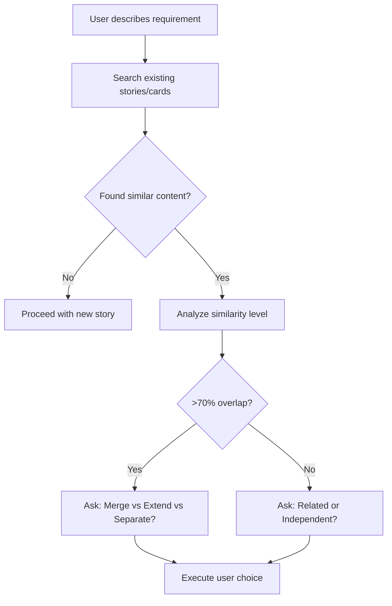

# Duplicate Story Prevention Guide

## Overview
Before creating any new story, AI MUST check for duplicates to prevent redundant work.

## AI Auto-Translation for Multi-Language Teams

**Key Principle**: When user uses Chinese, AI automatically translates to English for search. When user uses English, AI understands Chinese synonyms in docs. No need for manual `aliases` field - AI handles translation dynamically.

**Benefits**:
- Zero maintenance cost - AI adapts to any new terminology
- Better coverage - AI understands context and synonyms beyond predefined aliases
- Dynamic translation - No manual metadata updates needed

## Three-Layer Search Pattern

```bash
# Example: User says "我想实现订单导出功能" (Chinese)
# AI automatically executes THREE-LAYER multi-language search:

# ========================================
# Layer 0: PRD Level (Product domain check)
# ========================================
grep -ri "订单.*导出\|订单.*分析" docs/prd/              # Chinese
grep -ri "order.*export\|order.*analytics" docs/prd/  # English
# Check if this feature is already defined in PRD as planned capability

# ========================================
# Layer 1: Story Level (User capability check)
# ========================================
grep -ri "订单.*导出\|订单.*下载" docs/stories/        # Chinese keywords
grep -ri "order.*export\|order.*download" docs/stories/  # AI-translated English
grep -ri "data.*export\|extract.*order" docs/stories/    # AI synonym expansion

# ========================================
# Layer 2: Card Level (Technical implementation check)
# ========================================
grep -r "GET\|POST\|PUT\|DELETE" docs/cards/*.md | grep -i "export\|download"
find docs/cards/ -name "*order*" -o -name "*export*"

# ========================================
# Layer 3: Code Level (Actual implementation check)
# ========================================
ls src/modules/ | grep -i "order\|export"
grep -r "router.get.*export\|router.post.*export" src/modules/*/router.ts

# ========================================
# Layer 4: Relationship metadata check
# ========================================
cat docs/stories/_index.yaml | grep -B 3 -A 3 -i "order\|export"
```

## AI Translation Examples

```
用户输入: "批量导入票务"
AI搜索: 批量.*导入 | bulk.*import | batch.*import | ticket.*import

用户输入: "订单统计报表"
AI搜索: 订单.*统计 | order.*statistic | order.*report | order.*analytics

用户输入: "支付回调"
AI搜索: 支付.*回调 | payment.*callback | payment.*webhook | payment.*notify
```

## Similarity Analysis Decision Tree



## User Clarification Template

**AI MUST ask user for clarification when similarity detected:**

```
🤖 我发现这两个需求非常相似（XXX vs YYY）：

   选项 1: 合并为一个故事 - 统一的[功能名称]
   选项 2: 创建两个独立故事 - 请说明业务场景区别
   选项 3: 扩展现有故事 - 已有类似功能，仅需增强

   您的选择？
```

## When to Create New Story

**Only create new story if:**
- ✅ User confirms it's a different business scenario
- ✅ Different user personas or access levels
- ✅ Different technical requirements or constraints
- ✅ No existing story can be extended to cover this need

## Red Flags Indicating Potential Duplication

- 🚨 Similar verbs in user stories ("查看订单" vs "浏览订单")
- 🚨 Same domain entities (Order, Ticket, User, etc.)
- 🚨 Overlapping API endpoints or data models
- 🚨 Similar success criteria or user value propositions

## Example: Preventing Duplicate Order Analytics Stories

**Scenario**: User describes two similar requirements

**Request 1**: "我想实现订单统计功能" (I want to implement order statistics)
**Request 2**: "需要订单报表导出" (Need order report export)

**AI Analysis**:
```bash
# Search finds:
docs/stories/US-XXX.md: "Order Analytics and Reporting"
  - User can view order statistics
  - User can export order data

# Similarity: 85% overlap
```

**AI Response**:
```
🤖 发现现有故事 US-XXX 已包含类似功能：
   - 订单统计 (Order Statistics)
   - 数据导出 (Data Export)

   建议：扩展 US-XXX 而非创建新故事

   是否同意扩展现有故事？
```

**User Choice**: "同意扩展" → AI updates US-XXX instead of creating duplicate

## Validation

**After implementing duplicate prevention:**
- ✅ Prevents duplicate stories for same functionality
- ✅ Forces AI to search before creating
- ✅ Puts decision power with user, not AI assumptions
- ✅ Saves development time by avoiding redundant work

---

**Related Case Study**: See `docs/cases/CASE-005-duplicate-story-prevention.md` for real-world example
