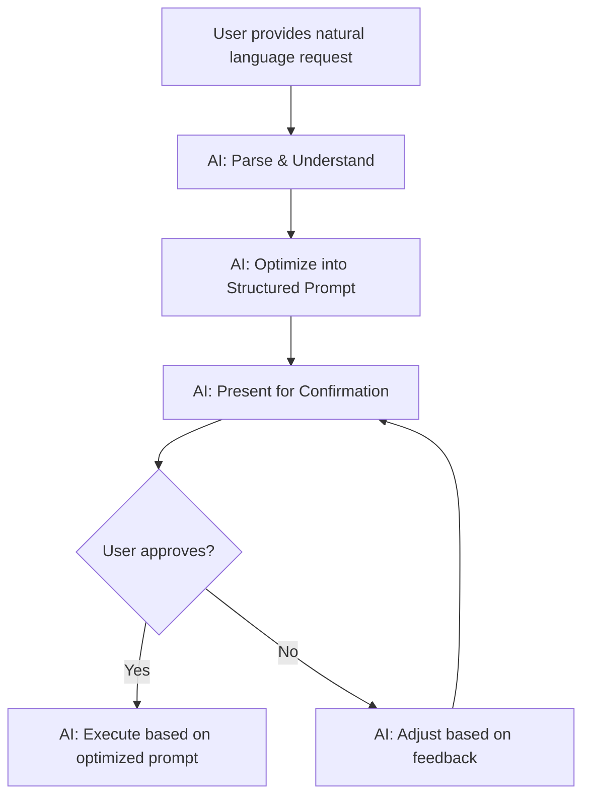

# Natural Language Optimization Guide

## Overview
When user provides requirements in natural language, AI MUST optimize them into structured prompts before implementation. This ensures accurate understanding and prevents rework.

## The 5-Step Workflow



### Step-by-Step Process

1. **Parse & Understand** - Extract core intent, requirements, and constraints
2. **Optimize into Structured Prompt** - Convert to clear, actionable specification
3. **Present for Confirmation** - Show optimized version with clarifying questions
4. **Wait for User Approval** - Don't proceed without explicit confirmation
5. **Execute Based on Optimized Prompt** - Implement exactly what was confirmed

## Common Request Scenarios

### Scenario 1: Feature Request (Story Level)

**User Input (Natural Language):**
```
我想让用户能够查看他们的订单历史
```

**AI Optimized Prompt:**
```
📋 理解你的需求，优化后的提示词：

**功能范围：**
- 用户故事：作为用户，我想查看我的历史订单，以便追踪购买记录
- API端点：GET /api/orders/history
- 返回数据：分页的订单列表（订单号、状态、金额、创建时间）
- 权限要求：需要用户身份认证
- 文档层级：新用户能力 → 需要创建Story

**需要确认：**
1. 是否需要筛选功能（按状态、时间范围、商品类型）？
2. 是否需要单个订单详情接口（GET /api/orders/:id）？
3. 是创建新Story还是扩展现有的订单管理Story（US-001）？
4. 是否需要订单项详情（包含票务信息）？

**技术决策：**
- 默认分页：20条/页
- Mock优先开发
- 响应时间：<200ms

请确认方向后我再开始实现。
```

**Why This Works:**
- ✅ Clarifies exact API contract needed
- ✅ Identifies document layer (Story vs Card)
- ✅ Surfaces hidden requirements (filtering, details)
- ✅ Proposes technical defaults for user to accept/modify

---

### Scenario 2: Bug Fix Request

**User Input (Natural Language):**
```
订单状态更新有问题，有时候支付成功了但状态还是pending
```

**AI Optimized Prompt:**
```
📋 理解你的问题，优化后的诊断计划：

**问题描述：**
- 症状：订单支付成功后，状态未从'pending'更新
- 影响范围：部分订单（不是全部）
- 预期行为：支付成功 → 状态应变为'paid'或'confirmed'

**诊断计划：**
1. Reality Check: 检查支付回调处理逻辑
   ```bash
   grep -r "payment.*callback\|webhook" src/modules/order/
   curl http://localhost:8080/api/orders/:id  # 查看实际状态
   ```

2. 检查数据库事务处理
   - 查看订单状态更新的事务完整性
   - 验证支付回调是否正确调用状态更新

3. 查看日志/错误信息
   - 支付回调是否成功接收
   - 数据库更新是否有错误

**需要确认：**
1. 这是新问题还是历史遗留问题？
2. 有具体的订单ID可以调试吗？
3. 支付渠道是哪个（微信/支付宝/其他）？
4. 复现频率大概多少？

请提供更多信息，我将立即开始诊断。
```

**Why This Works:**
- ✅ Structures the debugging approach
- ✅ Identifies key diagnostic commands
- ✅ Asks for specific context needed
- ✅ Sets clear next steps

---

### Scenario 3: Technical Enhancement

**User Input (Natural Language):**
```
现在订单查询太慢了，能不能优化一下性能
```

**AI Optimized Prompt:**
```
📋 理解你的需求，优化后的性能诊断计划：

**问题分析：**
- 症状：订单查询响应慢
- 目标：提升查询性能

**诊断步骤：**
1. Reality Check - 测量当前性能
   ```bash
   curl -w "@curl-format.txt" http://localhost:8080/api/orders
   # 记录当前响应时间基准
   ```

2. 定位瓶颈
   - 数据库查询慢？（检查是否有N+1查询、缺少索引）
   - 数据量大？（检查是否需要分页优化）
   - 关联查询多？（检查JOIN数量）

3. 优化方案（需确认优先级）
   - 选项1: 添加数据库索引（快速，低风险）
   - 选项2: 实现查询结果缓存（中等复杂度）
   - 选项3: 引入分页+过滤（需改API契约）
   - 选项4: 数据库查询优化（重构SQL）

**需要确认：**
1. 当前平均响应时间是多少？目标是多少？
2. 数据量大概多少？（订单总数）
3. 使用场景是什么？（管理后台列表 vs 用户个人订单）
4. 可以接受API契约变更吗？（如强制分页）

请提供性能指标和优先级，我将提供具体优化方案。
```

**Why This Works:**
- ✅ Establishes performance baseline first
- ✅ Offers multiple optimization strategies
- ✅ Asks for constraints and priorities
- ✅ Avoids premature optimization

---

### Scenario 4: API Design Question

**User Input (Natural Language):**
```
我想加一个接口可以批量更新订单状态
```

**AI Optimized Prompt:**
```
📋 理解你的需求，优化后的API设计方案：

**功能需求：**
- 批量更新订单状态
- 目标用户：管理员/运营人员

**API设计选项：**

**方案 1: 批量更新接口（推荐）**
```http
PUT /api/orders/batch-status
Content-Type: application/json

{
  "order_ids": ["ORD001", "ORD002", "ORD003"],
  "status": "shipped",
  "reason": "已发货"  // 可选
}

Response:
{
  "success_count": 2,
  "failed_count": 1,
  "failures": [
    {"order_id": "ORD002", "reason": "订单已取消，无法更新"}
  ]
}
```

**方案 2: 单个更新循环调用**
```http
PUT /api/orders/:id/status
（客户端循环调用）
```

**需要确认：**
1. 预期一次更新多少订单？（数量级）
2. 是否需要事务性？（全部成功或全部失败 vs 部分成功）
3. 是否需要审计日志？（记录谁在什么时候批量更新了哪些订单）
4. 权限控制：只有管理员可以批量更新？
5. 状态转换规则：是否允许任意状态转换？（如paid→cancelled）

**技术考虑：**
- 建议：方案1（原子性操作，减少网络开销）
- 添加Card: `batch-order-status-update.md`
- 实现事务保证（可选择全部成功或部分成功模式）
- 响应时间预估：<500ms for 100 orders

请选择方案并确认业务规则。
```

**Why This Works:**
- ✅ Provides multiple design options
- ✅ Highlights tradeoffs and considerations
- ✅ Asks about business rules and constraints
- ✅ Estimates technical feasibility

---

## Template Responses by Request Type

### Feature Request Template
```
📋 理解你的需求，优化后的提示词：

**功能范围：**
- 用户故事：[As a <role>, I want to <action>, so that <benefit>]
- API端点：[HTTP METHOD] [/api/path]
- 返回数据：[Data structure]
- 权限要求：[Authentication/Authorization]
- 文档层级：[PRD/Story/Card]

**需要确认：**
1. [Scope question]
2. [Integration question]
3. [Business logic question]

**技术决策：**
- [Default 1]
- [Default 2]

请确认方向后我再开始实现。
```

### Bug Fix Template
```
📋 理解你的问题，优化后的诊断计划：

**问题描述：**
- 症状：[Observed behavior]
- 影响范围：[Scope of impact]
- 预期行为：[Expected behavior]

**诊断计划：**
1. Reality Check: [Commands to verify current state]
2. [Diagnostic step 2]
3. [Diagnostic step 3]

**需要确认：**
1. [Context question]
2. [Reproduction question]
3. [Environment question]

请提供更多信息，我将立即开始诊断。
```

### Performance Optimization Template
```
📋 理解你的需求，优化后的性能诊断计划：

**问题分析：**
- 症状：[Performance issue]
- 目标：[Performance goal]

**诊断步骤：**
1. Reality Check - 测量当前性能
   [Measurement commands]
2. 定位瓶颈
   - [Potential bottleneck 1]
   - [Potential bottleneck 2]
3. 优化方案（需确认优先级）
   - 选项1: [Quick win]
   - 选项2: [Medium effort]
   - 选项3: [Major refactor]

**需要确认：**
1. [Current baseline]
2. [Target metrics]
3. [Constraints]

请提供性能指标和优先级。
```

### API Design Template
```
📋 理解你的需求，优化后的API设计方案：

**功能需求：**
- [Core requirement]
- 目标用户：[User persona]

**API设计选项：**
方案 1: [Recommended approach]
[API contract example]

方案 2: [Alternative approach]
[API contract example]

**需要确认：**
1. [Business rule question]
2. [Scale question]
3. [Authorization question]

**技术考虑：**
- 建议：[Recommendation with rationale]

请选择方案并确认业务规则。
```

---

## Common Pitfalls to Avoid

### ❌ Anti-Pattern: Assuming Without Asking
```
User: "订单列表需要分页"
AI: *Directly implements pagination with default 10 items/page*
```
**Problem**: User might want 20, 50, or 100 items/page

### ✅ Correct Pattern: Clarify Then Implement
```
User: "订单列表需要分页"
AI:
📋 理解你的需求，优化后的分页设计：

**分页参数：**
- 默认每页：20条（可配置为10/20/50/100）
- 最大每页：1000条
- 参数：?page=1&limit=20

**需要确认：**
1. 默认每页多少条合适？
2. 是否需要总数统计（total_count）？

请确认参数后实现。
```

---

### ❌ Anti-Pattern: Over-Engineering
```
User: "加个订单导出功能"
AI: *Designs complex export system with scheduling, email notifications, background jobs*
```
**Problem**: User might just need simple CSV download

### ✅ Correct Pattern: Start Simple, Ask for More
```
User: "加个订单导出功能"
AI:
📋 理解你的需求，优化后的导出方案：

**简单方案（推荐）：**
- GET /api/orders/export?format=csv
- 同步导出（适合<1000条订单）
- 浏览器直接下载CSV文件

**复杂方案（如果需要）：**
- 异步任务队列
- 邮件发送下载链接
- 支持大数据量（>10万条）

**需要确认：**
1. 预计导出数据量？（决定同步/异步）
2. 导出格式：CSV/Excel/JSON？
3. 谁使用这个功能？（管理员 vs 普通用户）

请选择适合的方案。
```

---

## Multi-Language Support

**AI automatically handles Chinese ↔ English translation:**

```
User (Chinese): "我想实现用户积分系统"
AI searches for: "用户.*积分 | user.*points | loyalty.*program | reward.*system"

User (English): "I want to implement a points system"
AI searches for: "points.*system | 积分.*系统 | loyalty | 会员.*积分"
```

**Benefits:**
- Zero maintenance cost
- Understands context and synonyms
- Works with any language pair

---

## Validation Criteria

**Successful natural language optimization achieves:**

- ✅ User confirms "yes, that's what I want" before implementation
- ✅ Clear API contracts specified upfront
- ✅ Business rules and constraints surfaced early
- ✅ Document layer (PRD/Story/Card) identified correctly
- ✅ Technical defaults proposed for user approval
- ✅ Avoids rework due to misunderstanding

**Red flags indicating optimization failure:**

- 🚨 AI starts implementing without user confirmation
- 🚨 User says "that's not what I meant" after implementation
- 🚨 Multiple rounds of clarification after code is written
- 🚨 Rework needed because assumptions were wrong

---

## Real-World Impact

**Before Natural Language Optimization:**
- User: "订单列表需要分页"
- AI: *Implements with 10 items/page*
- User: "不是，我要50条一页"
- Result: Rework, 15 minutes wasted

**After Natural Language Optimization:**
- User: "订单列表需要分页"
- AI: *Presents optimized prompt with options*
- User: "50条一页，显示总数"
- Result: Correct implementation first time, 15 minutes saved

**Estimated Time Savings:**
- 30% reduction in rework
- 50% fewer clarification rounds
- Higher user satisfaction

---

**Related Patterns:**
- [Duplicate Prevention](DUPLICATE-PREVENTION.md) - Similar multi-language search approach
- [Document Layer Decision](DOCUMENT-LAYER-DECISION.md) - Identifies correct documentation layer
- [API Change Management](API-CHANGE-MANAGEMENT.md) - API contract validation

**Related Case Study**: See `docs/cases/CASE-DISCOVER-AI-WORKFLOW.md` for workflow evolution
