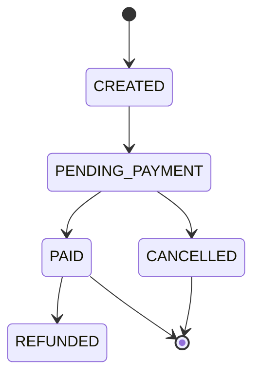
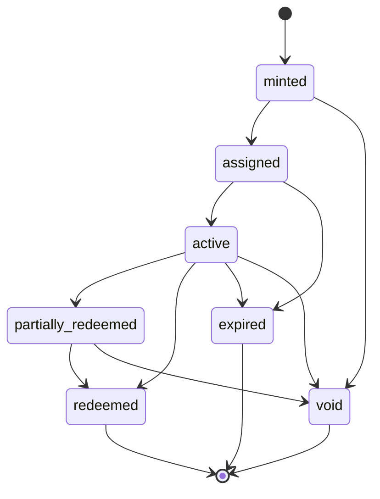

# State Machines — v0.1

## Order

```mermaid
stateDiagram-v2
  [*] --> CREATED
  CREATED --> PENDING_PAYMENT
  PENDING_PAYMENT --> PAID
  PENDING_PAYMENT --> CANCELLED
  PAID --> REFUNDED
  CANCELLED --> [*]
  PAID --> [*]
```

## Ticket

```mermaid
stateDiagram-v2
  [*] --> minted
  minted --> assigned
  assigned --> active
  active --> partially_redeemed
  partially_redeemed --> redeemed
  active --> redeemed
  active --> expired
  assigned --> expired
  minted --> void
  active --> void
  partially_redeemed --> void
  redeemed --> [*]
  expired --> [*]
  void --> [*]
```
