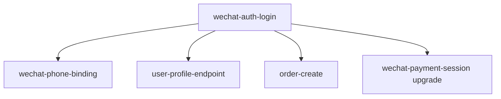

# US-014: WeChat Mini-Program User Authentication

## Story Analysis

### 1. Story Understanding

#### Core Story
**As a** WeChat mini-program user
**I want** to log in using my WeChat account with one tap
**So that** I can quickly purchase tickets and manage my orders without email registration

#### Business Context
- **Business Driver**: PRD-004 (WeChat Mini-Program Authentication) - Enable mobile-first commerce
- **Market Opportunity**: WeChat 1.3 billion users, mini-programs primary mobile commerce channel
- **Revenue Impact**: Unlock mobile sales channel (target: 40% of GMV within 3 months)
- **Timeline Constraint**: 2 weeks (core blocker for mobile commerce expansion)

#### Acceptance Criteria
- [x] User can authenticate via WeChat authorization (wx.login)
- [x] System automatically creates user account on first login (no manual registration)
- [x] System returns JWT token for authenticated API access (7-day validity)
- [x] User can optionally bind phone number via WeChat authorization (getPhoneNumber)
- [x] Phone number uses WeChat new API (2021+, no session_key decryption needed)
- [x] Login state persists across app sessions (JWT token stored in wx.storage)
- [x] Login completes in <500ms (95th percentile)
- [x] Login success rate >98%
- [x] Existing JWT authentication middleware reused (src/middlewares/auth.ts)
- [x] User profile endpoints work with WeChat-authenticated users

### 2. Business Rules Extraction

#### Timing Rules
- **Login availability**: 24/7 (no maintenance windows)
- **Code validity**: WeChat temporary code expires after 5 minutes
- **JWT expiry**: Tokens valid for 7 days (configurable via JWT_EXPIRES_IN)
- **Phone binding timing**: Optional, prompted after first successful purchase

#### Permission Rules
- **Public access**: Login endpoint requires no authentication
- **Phone binding**: Requires valid JWT token (user must be logged in)
- **Future enhancements**: Support WeChat QR code login for web (Phase 2)

#### Validation Rules
- **WeChat code**:
  - Format: Alphanumeric string from wx.login()
  - Validity: Must be unused, not expired (5-minute window)
  - Single-use: Code invalidated after code2Session call

- **openid**:
  - Format: 28-character string starting with 'o' (e.g., "oXXXXXXXXXXXXXXXXXXXXXXXXXXX")
  - Uniqueness: One WeChat user = one system user
  - Persistence: Stored as unique indexed column in users table

- **Phone number**:
  - Format: E.164 format (country code + number, e.g., "+8613800138000")
  - Validation: WeChat API returns validated phone number
  - Storage: Plaintext (already decrypted by WeChat API)

#### State Rules
- **User creation** (first login):
  ```
  NOT_EXISTS → CREATED → JWT_ISSUED
  - users table: Insert new row with wechat_openid
  - Default name: "WeChat User {last_6_chars_of_openid}"
  - auth_type: 'wechat'
  ```

- **User login** (returning):
  ```
  EXISTS → JWT_REFRESHED
  - Update last_login_at timestamp
  - Issue new JWT token
  - No user data modification
  ```

- **Phone binding**:
  ```
  USER_LOGGED_IN → PHONE_AUTHORIZATION → PHONE_BOUND
  - Requires JWT token validation
  - Update users.phone field
  - Optional: Update wechat_extra JSON with country code
  ```

#### Audit Rules
- **Login events**: Log successful and failed login attempts
  - Fields: user_id (if known), openid, timestamp, IP address, result
  - Retention: 90 days minimum

- **Phone binding events**: Log phone binding attempts
  - Fields: user_id, phone, timestamp, result
  - Retention: 365 days (compliance requirement)

- **WeChat API calls**: Log all external API interactions
  - Fields: API endpoint, request time, response time, status code, error details
  - Purpose: Debugging, rate limit monitoring

### 3. API Endpoints Needed

#### Endpoint 1: WeChat Login
```yaml
POST /auth/wechat/login
Summary: Authenticate user via WeChat mini-program code
Security: None required (public endpoint)

Request Body:
  code: string (required)
    Description: Temporary code from wx.login() (5-minute validity)
    Example: "081AbcDEF2GH3jI4KLmN5OP0AbcDEF17"

Response 200:
  token: string
    Description: JWT token for authenticated API access
    Example: "eyJhbGciOiJIUzI1NiIsInR5cCI6IkpXVCJ9..."
  user: object
    user_id: number
    name: string
    avatar_url: string | null
    phone: string | null
    auth_type: string (enum: 'wechat' | 'email' | 'phone')
    created_at: string (ISO 8601)
  needs_phone: boolean
    Description: Indicates whether user should be prompted to bind phone
    Example: true (if user.phone is null)

Response 401:
  code: "WECHAT_AUTH_FAILED"
  message: "WeChat authentication failed"
  details: "Code2Session API error: invalid code or expired"

Response 422:
  code: "INVALID_CODE"
  message: "WeChat code is required"

Response 500:
  code: "INTERNAL_SERVER_ERROR"
  message: "Login failed due to server error"

Rate Limiting: 100 requests per IP per minute
Timeout: 5 seconds (includes WeChat API call)
```

#### Endpoint 2: Phone Number Binding
```yaml
POST /auth/wechat/phone
Summary: Bind user's phone number via WeChat authorization
Security: Bearer token required (authenticate middleware)

Headers:
  Authorization: "Bearer {jwt_token}"

Request Body:
  code: string (required)
    Description: Authorization code from WeChat getPhoneNumber
    Example: "021XyZaBcDeF3GH4jI5KLmN6OP7XyZaBc18"

Response 200:
  phone: string
    Description: Bound phone number (E.164 format)
    Example: "+8613800138000"
  user: object (updated user profile)

Response 401:
  code: "UNAUTHORIZED"
  message: "Please log in first"

Response 422:
  code: "INVALID_PHONE_CODE"
  message: "Phone authorization code is invalid or expired"

Response 500:
  code: "PHONE_BINDING_FAILED"
  message: "Failed to bind phone number"

Rate Limiting: 50 requests per user per hour
Timeout: 5 seconds (includes WeChat API call)
```

#### Endpoint 3: Token Refresh (Future Enhancement)
```yaml
POST /auth/wechat/refresh
Summary: Refresh JWT token before expiry
Security: Bearer token required
Status: Not in MVP (Phase 2 feature)
```

### 4. Data Impact Analysis

#### Existing Tables Modified
- **users**: Add WeChat-related columns
  ```sql
  ALTER TABLE users
  ADD COLUMN wechat_openid VARCHAR(64) UNIQUE NULL AFTER email,
  ADD COLUMN auth_type VARCHAR(20) NOT NULL DEFAULT 'wechat' AFTER name,
  ADD COLUMN wechat_extra JSON NULL AFTER auth_type,
  ADD INDEX idx_wechat_openid (wechat_openid);
  ```

  **New Fields**:
  - `wechat_openid`: Unique identifier from WeChat (indexed for fast lookup)
  - `auth_type`: Enum to support multiple login methods ('wechat', 'email', 'phone')
  - `wechat_extra`: JSON field for flexible WeChat data storage
    ```json
    {
      "nickname": "张三",
      "gender": 1,
      "language": "zh_CN",
      "city": "深圳",
      "province": "广东",
      "country": "中国",
      "phone_country_code": "86"
    }
    ```

#### New Tables Required
- **None**: Reuse existing users table with new columns
- **Rationale**:
  - Avoids complex joins (single-table query performance)
  - openid is core identity (belongs in users table)
  - JSON field provides flexibility for WeChat-specific data

#### New Tables NOT Required (Explicitly Avoided)
- ❌ **wechat_sessions**: Do NOT store session_key (security risk)
- ❌ **wechat_users**: Separate table creates unnecessary complexity

#### Migration Requirements
- **Migration file**: `db/migrations/0014_add_wechat_auth.sql`
- **Backfill existing data**: Not required (new columns default to NULL)
- **Breaking changes**: No (additive changes only)
- **Performance impact**: Low
  - New index on wechat_openid: Improves login query performance
  - JSON column: Minimal overhead (data rarely queried, mostly displayed)
- **Rollback strategy**: Drop columns if needed (no data loss for non-WeChat users)

### 5. Integration Touchpoints

#### Existing APIs/Services Enhanced
- **JWT Authentication Middleware** (src/middlewares/auth.ts):
  - ✅ No changes needed (already supports {id, email} payload)
  - Enhancement: JWT payload now includes openid for WeChat users
    ```typescript
    // Before: {id: 123, email: "user@example.com"}
    // After: {id: 123, email: null, openid: "oXXXXXXXXXXXXXXXXXXXXXXXXXXX"}
    ```

- **User Profile Endpoints** (US-009, already completed):
  - `GET /profile`: Works with WeChat-authenticated users (req.user.id)
  - `PUT /profile`: Users can update name, avatar_url after WeChat login
  - `GET /profile/activity`: Tracks WeChat login events

- **Order Creation** (US-001):
  - `POST /orders`: Extracts user_id from JWT token (works for WeChat users)
  - Enhancement: Orders now linked to WeChat users via openid

- **WeChat Payment Session** (US-010A, currently mock):
  - `POST /payments/wechat/session`: **UNBLOCKED** - can now use real openid
  - Enhancement: Fetch openid from authenticated user instead of mock data
    ```typescript
    // Before: const openid = "mock-openid"
    // After: const openid = req.user.openid (from JWT)
    ```

#### New Integration Points
- **WeChat API Client**:
  - Endpoint: `https://api.weixin.qq.com/sns/jscode2session`
    - Purpose: Exchange code for openid
    - Rate limit: Shared with other WeChat APIs (no specific limit)

  - Endpoint: `https://api.weixin.qq.com/cgi-bin/token`
    - Purpose: Get access_token for other WeChat APIs
    - Rate limit: 2000 requests/day
    - Caching: Required (2-hour validity)

  - Endpoint: `https://api.weixin.qq.com/wxa/business/getuserphonenumber`
    - Purpose: Get user's phone number (new API, no session_key needed)
    - Rate limit: Shared access_token quota

- **Access Token Cache**:
  - Strategy: In-memory cache (or Redis for multi-instance deployments)
  - TTL: 7200 seconds (2 hours, WeChat specification)
  - Refresh: Automatic refresh 5 minutes before expiry

#### Notifications/Events Triggered
- **User Created Event** (first login):
  - Trigger: New user row inserted in database
  - Consumers:
    - Analytics service (track user acquisition)
    - Marketing automation (welcome message)

- **Phone Bound Event**:
  - Trigger: user.phone updated
  - Consumers:
    - Notification service (enable SMS notifications)
    - Customer service (enable phone support)

#### External Integrations Required
- **WeChat Platform**:
  - Prerequisite: WeChat mini-program AppID and AppSecret
  - Configuration: Server domain whitelist in WeChat backend
  - Compliance: Follow WeChat platform rules (no unauthorized data collection)

#### Frontend Changes Required
- **Mini-Program UI**:
  - Add "Login with WeChat" button (uses wx.login() API)
  - Add "Bind Phone Number" button (uses open-type="getPhoneNumber")
  - Store JWT token in wx.storage (persistent storage)
  - Add token to Authorization header for all authenticated API calls

- **Error Handling**:
  - Display friendly error messages (e.g., "Login failed, please try again")
  - Retry logic for network failures
  - Prompt re-login when JWT expires

### 6. Proposed Cards Breakdown

#### Card 1: wechat-auth-login (Core, Blocking)
- **Slug**: `wechat-auth-login`
- **Team**: C - Identity & Access
- **Purpose**: Core WeChat authentication with automatic user creation/login
- **Endpoints**: `POST /auth/wechat/login`
- **Dependencies**:
  - Reuses: JWT authentication middleware (src/middlewares/auth.ts)
  - Reuses: users table and UserEntity
  - New: WeChat API client (code2Session)
- **Database Changes**: Add wechat_openid, auth_type, wechat_extra columns to users table
- **Priority**: High (Blocker for mobile commerce)
- **Estimated Effort**: 5 days (Mock-first → Real API → Testing)
- **Success Criteria**:
  - Login success rate >98%
  - Login latency P95 <500ms
  - JWT token correctly issued
  - User creation and lookup working in both Mock and Database modes

#### Card 2: wechat-phone-binding (Enhancement, Optional)
- **Slug**: `wechat-phone-binding`
- **Team**: C - Identity & Access
- **Purpose**: Optional phone number binding using WeChat new API
- **Endpoints**: `POST /auth/wechat/phone`
- **Dependencies**:
  - Requires: wechat-auth-login (user must be logged in)
  - New: WeChat access_token cache management
  - New: WeChat getuserphonenumber API integration
- **Database Changes**: Update users.phone field
- **Priority**: Medium (Nice-to-have for enhanced features)
- **Estimated Effort**: 3 days (Cache → API → Testing)
- **Success Criteria**:
  - Phone binding success rate >95%
  - Phone stored correctly in database
  - Works with WeChat new API (no session_key decryption)

### 7. Cross-Story Relationships

#### Enhances (What this story improves)
- **US-001 (Buy package and redeem via QR)**:
  - Enhancement: WeChat users can now purchase tickets
  - Integration: Order creation uses user_id from WeChat login

- **US-009 (User profile and settings management)**:
  - Enhancement: WeChat users can access profile endpoints
  - Integration: Profile shows WeChat nickname, avatar

- **US-010A (DeepTravel旅客闭环体验)**:
  - Unblock: Provides authentication required for mini-program
  - Integration: wechat-payment-session can now use real openid

#### Enhanced By (Future enhancements to this story)
- **Phase 2: Account Linking**:
  - Allow users with email accounts to link WeChat
  - Support multiple login methods for one user

- **Phase 2: WeChat QR Code Login (Web)**:
  - Extend WeChat login to web app
  - Use same backend API with QR code flow

#### Dependencies
- **Foundation (Must exist first)**:
  - ✅ JWT authentication middleware (exists)
  - ✅ User profile system (US-009 completed)
  - ✅ users table (exists)

- **Coordination Required**:
  - wechat-payment-session (US-010A): Update to use real openid after this story
  - Order creation (US-001): Works automatically with WeChat users

### 8. Implementation Sequence



**Sequence Dependencies**:
1. **wechat-auth-login** → **wechat-phone-binding**: Phone binding requires login
2. **wechat-auth-login** → **user-profile-endpoint**: Profile access requires authentication
3. **wechat-auth-login** → **order-create**: Orders require user_id from login
4. **wechat-auth-login** → **wechat-payment-session upgrade**: Payment requires openid

### 9. Testing Strategy

#### Unit Tests
- `wechat-api.service.test.ts`: Test WeChat API client (mocked responses)
- `wechat-auth.controller.test.ts`: Test login/phone binding logic

#### Integration Tests
- Test complete login flow (Mock mode):
  ```bash
  curl -X POST http://localhost:8080/auth/wechat/login \
    -d '{"code":"mock-code-12345"}'
  # Expect: 200 with JWT token
  ```

- Test phone binding (Mock mode):
  ```bash
  curl -X POST http://localhost:8080/auth/wechat/phone \
    -H "Authorization: Bearer {token}" \
    -d '{"code":"mock-phone-code"}'
  # Expect: 200 with phone number
  ```

#### E2E Tests (Newman Collection)
- **Scenario 1**: New user login → Token issued → Profile access
- **Scenario 2**: Returning user login → Token refreshed
- **Scenario 3**: Login → Bind phone → Order creation → Payment
- **Scenario 4**: Error handling (invalid code, expired token)

#### Manual Testing (Real WeChat Mini-Program)
- Deploy backend to staging environment
- Configure WeChat mini-program with staging API URL
- Test real wx.login() flow
- Test real getPhoneNumber() flow

### 10. Rollout Plan

#### Phase 1: Internal Testing (Day 1-2)
- Deploy to dev environment
- Mock-first testing
- Team members test with demo tokens

#### Phase 2: Staging Environment (Day 3-4)
- Deploy to staging with real WeChat API
- Test with real mini-program
- Verify performance metrics

#### Phase 3: Beta Launch (Day 5-7)
- Deploy to production
- Invite 100 beta users
- Monitor metrics and error logs

#### Phase 4: Full Launch (Day 8+)
- Open to all mini-program users
- Monitor success rate and latency
- Gather user feedback

---

## Implementation Readiness Checklist

### Prerequisites
- [x] PRD-004 approved
- [x] Story US-014 created
- [ ] WeChat mini-program AppID and AppSecret obtained
- [ ] WeChat mini-program enterprise certified (for phone number API)
- [ ] Server domain added to WeChat whitelist
- [ ] Environment variables documented (.env.example)

### Technical Readiness
- [x] JWT authentication middleware exists
- [x] User profile system complete (US-009)
- [x] users table and UserEntity exist
- [ ] Database migration planned (wechat_openid columns)
- [ ] WeChat API documentation reviewed
- [ ] Mock data strategy defined

### Team Readiness
- [ ] Development team assigned (1 full-stack engineer)
- [ ] QA test plan created
- [ ] Mini-program frontend integration plan
- [ ] Monitoring and alerting configured

---

## Success Metrics & Validation

### Business Metrics (PRD-004 Alignment)
- **User Acquisition**: 1000 new WeChat users in first month
- **Conversion Rate**: >90% (tap login → account created)
- **Mobile GMV**: Track ticket sales from WeChat users

### Technical Metrics
- **Login Success Rate**: >98%
- **Login Latency**: P50 <200ms, P95 <500ms
- **Phone Binding Rate**: >40% within first week
- **Error Rate**: <2%

### Validation Criteria
- All acceptance criteria met
- Newman E2E tests pass 100%
- Performance benchmarks achieved
- Security audit passed (no session_key storage)
- User feedback positive (>4.5/5 satisfaction)

---

## Related Documents
- **PRD**: PRD-004 (WeChat Mini-Program User Authentication System)
- **Cards**:
  - wechat-auth-login.md (Core login implementation)
  - wechat-phone-binding.md (Phone binding implementation)
- **Integration**: US-014-runbook.md (Frontend integration guide)
- **Testing**: us-014-wechat-auth.json (Newman collection)

---

**Document Status**: Draft (awaiting approval)
**Next Steps**: Create implementation cards (wechat-auth-login, wechat-phone-binding)
**Timeline**: 2 weeks from approval
