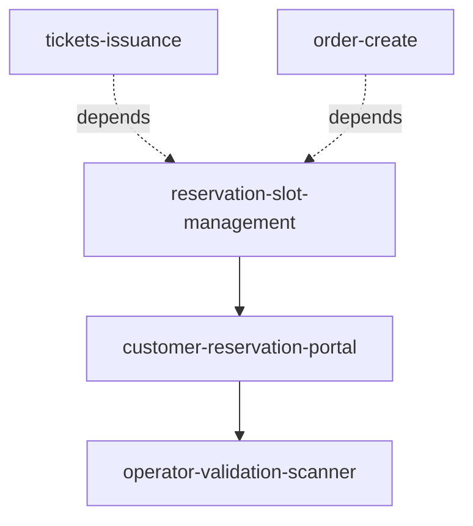

# US-015: Ticket Reservation & Validation System

## Business Context

### Problem Statement
Customers who purchase tickets cannot select specific date/time slots for venue visits. Venues lack capacity management tools and have no on-site validation mechanism to verify tickets for correct dates, leading to overcrowding and operational inefficiencies.

### Solution Overview
Implement a complete reservation and validation system with:
1. **Slot-Based Capacity Management**: Pre-configured time slots with capacity limits
2. **Customer Reservation Portal**: Web interface for selecting date/time
3. **Operator Validation App**: QR code scanning at venue entry

### Success Criteria
- ✅ Customers can reserve tickets for specific date/time slots
- ✅ Slot capacity enforced (e.g., 200 tickets per slot max)
- ✅ Operators can validate tickets via QR scanning
- ✅ Validation checks reservation date matches current date
- ✅ Reservation completion rate > 85%
- ✅ Average validation time < 10 seconds
- ✅ System uptime > 99.5%

---

## User Stories

### Customer Stories

**As a customer who purchased a ticket**
I want to select a specific date and time slot for my visit
So that I can plan my trip and avoid overcrowding at the venue

**As a customer making a reservation**
I want to see which time slots are available and how full they are
So that I can choose a less crowded time if I prefer

**As a customer with a reservation**
I want to receive a QR code confirmation
So that I can show it at the venue for easy entry

**As a customer managing multiple tickets**
I want to reserve all my tickets for the same slot or different slots
So that I can coordinate with my group

### Operator Stories

**As a venue operator**
I want to scan a customer's QR code and instantly see if it's valid for today
So that I can efficiently manage entry without delays

**As a venue operator**
I want to see clear visual indicators (GREEN/RED/YELLOW) for ticket validity
So that I can make quick decisions without reading detailed messages

**As a venue operator**
I want to know when a ticket is reserved for a different date
So that I can inform the customer and prevent incorrect entry

**As a venue manager**
I want to track how many tickets have been validated
So that I can monitor venue capacity in real-time

---

## Related Cards

| Card | Team | Description |
|------|------|-------------|
| reservation-slot-management | B - Fulfillment | Time slot configuration and capacity management |
| customer-reservation-portal | B - Fulfillment | Customer reservation UI and booking flow |
| operator-validation-scanner | C - Operations | QR scanning and ticket validation at venues |

> API contracts and technical implementation: see individual Card documentation

---

## Ticket Lifecycle

```
Purchase → PENDING_PAYMENT
  ↓ (payment confirmed)
ACTIVATED → (customer makes reservation)
  ↓
RESERVED → (operator scans on correct date)
  ↓
VERIFIED → (entry allowed)

Alternative paths:
RESERVED → EXPIRED (slot time passed without scan)
```

### Status Definitions

| Status | Description | Can Reserve? | Can Verify? |
|--------|-------------|--------------|-------------|
| PENDING_PAYMENT | Order created, awaiting payment | ❌ | ❌ |
| ACTIVATED | Payment confirmed | ✅ | ❌ |
| RESERVED | Slot reserved | ❌ (already reserved) | ✅ (on correct date) |
| VERIFIED | Scanned at venue | ❌ | ❌ (already used) |
| EXPIRED | Past validity period | ❌ | ❌ |

---

## Implementation Sequence



**Phase 1 (Sprint 1-2)**: Slot Management + Customer Portal
1. Create `reservation_slots` and `ticket_reservations` tables
2. Build slot availability API
3. Build ticket validation API
4. Build reservation creation API with capacity enforcement
5. Build customer UI: ticket entry, calendar, slot selection, confirmation

**Phase 2 (Sprint 3)**: Operator Validation
1. Build operator authentication
2. Build QR scanner interface
3. Build validation logic (date matching, status checks)
4. Build verification flow (mark as VERIFIED)
5. Build color-coded results UI

**Phase 3 (Sprint 4)**: Testing & Production
1. End-to-end testing
2. Load testing (concurrent reservations)
3. Security audit
4. Performance optimization
5. Production deployment

---

## Acceptance Criteria

### Functional Requirements

**Ticket Validation:**
- [ ] Customer can enter ticket code via URL parameter or manual entry
- [ ] System validates ticket status is ACTIVATED
- [ ] Error shown if ticket ALREADY_RESERVED, NOT_ACTIVATED, or EXPIRED
- [ ] Success returns ticket details for reservation flow

**Contact Collection:**
- [ ] Customer enters email and phone number
- [ ] Format validation for email (RFC 5322) and phone (E.164)
- [ ] MVP: Simple validation, no OTP
- [ ] Future: OTP verification via email/SMS

**Calendar & Slot Selection:**
- [ ] Monthly calendar displays dates with slots
- [ ] Green border: Available slots (>50% capacity)
- [ ] Yellow border: Limited slots (10-50% capacity)
- [ ] Gray: Full or no slots
- [ ] Past dates disabled
- [ ] Click date → Show time slots with capacity (e.g., "150/200 available")
- [ ] Click slot → Show confirmation page

**Reservation Creation:**
- [ ] Display summary: ticket, date, time, email, phone
- [ ] "Confirm" button creates reservation
- [ ] Transaction safety: Check capacity with row-level lock
- [ ] If slot full → Error with alternative slots suggested
- [ ] Success → Update ticket status to RESERVED
- [ ] Success → Increment slot booked_count
- [ ] Success → Send confirmation email with QR code

**Operator Scanning:**
- [ ] Operator login with PIN or username/password
- [ ] Scan page with QR scanner (camera access)
- [ ] Manual ticket code entry (fallback)
- [ ] Scan → Validate ticket and reservation

**Validation Results:**
- [ ] GREEN: Valid ticket for today → Show "VALID TICKET" with customer info → "Mark as Verified" button
- [ ] RED: Wrong date → Show "WRONG DATE" with reserved date
- [ ] RED: No reservation → Show "NO RESERVATION" message
- [ ] RED: Invalid ticket → Show "INVALID TICKET"
- [ ] YELLOW: Already verified → Show "ALREADY VERIFIED" with timestamp/operator
- [ ] Click "Mark as Verified" → Update status to VERIFIED, record timestamp and operator_id

**Verification:**
- [ ] Ticket status transitions RESERVED → VERIFIED
- [ ] Record verified_at timestamp
- [ ] Record verified_by operator ID
- [ ] Reservation status updated to VERIFIED
- [ ] Success message → Return to scan mode

### Non-Functional Requirements

**Performance:**
- [ ] Ticket validation API: < 300ms (P95)
- [ ] Slot availability API: < 500ms (P95)
- [ ] Reservation creation: < 1s (P95)
- [ ] Operator validation API: < 500ms (P95)
- [ ] Calendar rendering: < 2s for 90 days of slots

**Reliability:**
- [ ] Transaction safety prevents double-booking
- [ ] Row-level locking on slot capacity checks
- [ ] Unique constraint on ticket_reservations.ticket_id
- [ ] Idempotent verification (repeat scan shows warning, doesn't fail)

**Security:**
- [ ] Ticket codes: Minimum 16 characters, secure random
- [ ] Operator JWT tokens: 8-hour expiration
- [ ] API rate limiting: 10 req/min for reservations, 100 req/min for validation
- [ ] Role-based access control for operators

**Usability:**
- [ ] Clear error messages for all error states
- [ ] Color-coded validation results (GREEN/RED/YELLOW)
- [ ] Mobile-friendly operator interface
- [ ] QR code download and "Add to Calendar" on success page

---

## Business Rules

### Reservation Rules

**One Ticket = One Reservation**
- Each ticket can have only one active reservation
- Database enforced via UNIQUE constraint on ticket_id
- Cannot reserve same ticket for multiple slots

**Capacity Enforcement**
- Slot capacity is hard limit (no overbooking)
- Real-time capacity checking with row-level locks
- Transaction: Check capacity → Create reservation → Increment booked_count
- If capacity reached during transaction → Rollback, return error

**No Modifications (MVP)**
- Reservations cannot be changed or cancelled in MVP
- Future: Allow changes up to 24 hours before slot

**Expiration**
- Reservations expire after slot end_time
- Automated job: Update status RESERVED → EXPIRED
- Tickets may also expire based on product rules

### Validation Rules

**Date Matching (Strict)**
- Reservation date must equal current date
- No grace period (exact date match required)
- Wrong date → RED error with reserved date shown

**Status Checks**
- PENDING_PAYMENT → Cannot validate (need payment)
- ACTIVATED → Cannot validate (need reservation)
- RESERVED + correct date → Can validate (GREEN)
- RESERVED + wrong date → Cannot validate (RED)
- VERIFIED → Show warning (already entered), allow re-scan
- EXPIRED → Cannot validate

**Duplicate Scanning**
- First scan → Mark as VERIFIED
- Subsequent scans → Show warning with timestamp and operator
- Do not prevent re-verification (idempotent)

### Multi-Ticket Scenarios

**Customer buys 3 tickets:**
- Receives 3 separate ticket codes
- Must reserve each ticket individually
- Can reserve all for same slot (if capacity allows)
- Can reserve for different slots (flexible)

**Example:**
```
Order #456: 3 tickets
  Ticket 1 (TKT-001) → Reserved for Nov 14, 12:00 PM
  Ticket 2 (TKT-002) → Reserved for Nov 14, 12:00 PM
  Ticket 3 (TKT-003) → Reserved for Nov 15, 2:00 PM
```

---

## Data Requirements

> Database schema details: see related Cards (`reservation-slot-management`, `customer-reservation-portal`)

**Key Data Concepts**:
- Ticket status tracking (PENDING_PAYMENT → ACTIVATED → RESERVED → VERIFIED)
- Time slots with capacity limits
- Ticket-to-slot reservations (one ticket = one reservation)

---

## Testing Strategy

### Unit Tests
- Ticket status validation logic
- Slot capacity calculations
- Date matching validation
- Transaction rollback on capacity exceeded

### Integration Tests
- Create reservation → Check slot booked_count incremented
- Concurrent reservations → Verify one succeeds, others get error
- Validate ticket → Check JOIN with reservations and slots
- Verify ticket → Check status updated, timestamps recorded

### E2E Scenarios

**Scenario 1: Successful Reservation Flow**
```gherkin
Given a customer has an ACTIVATED ticket
When they enter ticket code on /reserve page
And they enter valid email and phone
And they select an available slot
And they confirm reservation
Then reservation is created
And ticket status becomes RESERVED
And slot booked_count is incremented
And confirmation email is sent with QR code
```

**Scenario 2: Slot Full Error**
```gherkin
Given a slot has 1 available spot remaining
When 2 customers try to reserve simultaneously
Then first customer succeeds
And second customer gets SLOT_FULL error
And alternative slots are suggested
```

**Scenario 3: Operator Validation - Valid Ticket**
```gherkin
Given a ticket is RESERVED for today (Nov 14)
When operator scans the QR code on Nov 14
Then validation result is GREEN
And screen shows "VALID TICKET" with customer info
When operator clicks "Mark as Verified"
Then ticket status becomes VERIFIED
And verified_at timestamp is recorded
And operator ID is recorded
```

**Scenario 4: Operator Validation - Wrong Date**
```gherkin
Given a ticket is RESERVED for Nov 20
When operator scans the QR code on Nov 14
Then validation result is RED
And screen shows "WRONG DATE"
And message says "Reserved for 2025-11-20"
And operator cannot mark as verified
```

**Scenario 5: Operator Validation - No Reservation**
```gherkin
Given a ticket is ACTIVATED but not reserved
When operator scans the QR code
Then validation result is RED
And screen shows "NO RESERVATION"
And message says "Customer must book a time slot first"
```

**Scenario 6: Already Verified Warning**
```gherkin
Given a ticket was verified at 09:30 AM by Jane
When operator scans the same ticket again at 10:00 AM
Then validation result is YELLOW
And screen shows "ALREADY VERIFIED"
And message shows "Verified at 09:30 AM by Jane Smith"
And operator can still re-verify if needed (idempotent)
```

---

## Risks & Mitigations

### Technical Risks

**Risk: Race Condition on Slot Capacity**
- **Mitigation**: Row-level locking (`SELECT ... FOR UPDATE`) + transactions
- **Mitigation**: Unique constraint on ticket_id prevents double-booking

**Risk: QR Scanner Not Working on Operator Devices**
- **Mitigation**: Manual ticket code entry fallback
- **Mitigation**: Test on multiple device types (iOS, Android, tablets)

**Risk: Email Delivery Failures**
- **Mitigation**: Queue failed emails for retry
- **Mitigation**: Show QR code on success page (not just email)

### Business Risks

**Risk: Customer Confusion About Reservation Requirement**
- **Mitigation**: Clear messaging on ticket purchase confirmation
- **Mitigation**: Reminder emails for unreserved tickets

**Risk: No-Show Rate (Reserved but Don't Arrive)**
- **Mitigation**: Phase 2 - implement waitlist for full slots
- **Mitigation**: Phase 2 - cancellation policies and fees

### Operational Risks

**Risk: Operators Lack Training on New Scanning Interface**
- **Mitigation**: Create operator training manual
- **Mitigation**: Color-coded UI simplifies decision-making

**Risk: Peak Capacity Limits**
- **Mitigation**: Monitor slot utilization, add slots dynamically
- **Mitigation**: Suggest alternative dates when slots full

---

## Metrics & Monitoring

### Key Metrics
- **Reservation Conversion Rate**: (reservations created / tickets validated) × 100%
- **Slot Utilization Rate**: (booked_count / total_capacity) × 100% per slot
- **Average Validation Time**: Time from scan to verification decision
- **Validation Accuracy**: % of correct GREEN/RED/YELLOW results
- **Failed Reservations by Reason**: Group by error code (SLOT_FULL, TICKET_ALREADY_RESERVED, etc.)

### Logging Events
- `ticket.validated` - {ticket_id, status, user_input}
- `reservation.created` - {ticket_id, slot_id, customer_email, timestamp}
- `reservation.failed` - {ticket_id, slot_id, reason, timestamp}
- `ticket.verified` - {ticket_id, operator_id, timestamp}
- `validation.result` - {ticket_id, result: GREEN|RED|YELLOW, reason}

### Alerts
- High reservation failure rate (>10% in 15 min)
- Slot utilization >90% (capacity warning)
- API response time >1s P95
- Authentication failure spike for operators

---

## Future Enhancements

### Phase 2 (Post-MVP)
- Reservation modification (change date/time)
- Reservation cancellation
- OTP verification for email/phone
- Admin dashboard for slot management
- Bulk ticket import for pre-made tickets

### Phase 3
- Mobile app (React Native) for customers and operators
- Push notifications (reservation reminders)
- Waitlist system for full slots
- Dynamic pricing based on demand

### Phase 4
- Analytics dashboard (utilization trends, revenue forecasting)
- Customer feedback collection
- CRM integration
- AI-powered capacity optimization

---

## Web 端 E2E 测试结果 (2025-12-16)

### 测试概要

| 指标 | 数值 |
|------|------|
| 总测试用例 | 72 |
| 通过 | 66 (91.67%) |
| 警告 | 6 (8.33%) |
| 评级 | **优秀** |

### 测试覆盖

- **票券验证**: OTA 票券 (DT-) + 小程序票券 (MP-) 验证
- **边界测试**: 32 项全部通过 (安全性 100%)
- **并发测试**: 系统能够处理并发预订请求
- **压力测试**: 50 次快速连续请求

### 发现的问题

| 优先级 | 问题 | 建议 |
|--------|------|------|
| **高** | 缺少 Rate Limiting | 添加速率限制 (每分钟 30 次) |
| **高** | 大 Payload (100KB) 导致 500 | 限制请求体大小为 10KB |
| 中 | 时段查询较慢 (1404ms) | 添加 Redis 缓存 |

### 已澄清 (非问题)

| 原报告 | 实际情况 |
|--------|---------|
| 预订后票券状态返回 UNKNOWN | **设计行为**: 小程序票券→RESERVED，OTA票券→保持ACTIVATED |

### 性能指标

| 端点 | 平均响应时间 |
|------|-------------|
| `/api/tickets/validate` | 627ms |
| `/api/reservation-slots/available` | 1404ms |
| `/api/reservations/create` | 688ms |

### 详细报告

- [WEB-RESERVATION-E2E-REPORT.md](../test-cases/WEB-RESERVATION-E2E-REPORT.md)
- [web-reservation-e2e.yaml](../test-cases/web-reservation-e2e.yaml)

---

**Story Status**: Draft - Ready for implementation
**Next Steps**: Review with teams → Estimate cards → Begin Sprint 1
