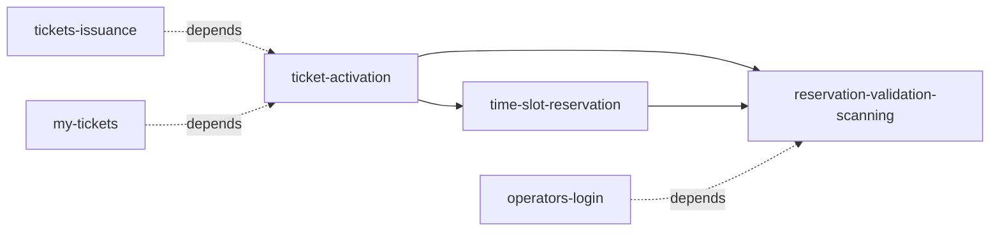

# US-016: Ticket Activation and Time-Slot Reservation

## Business Context

### Problem Statement
Customers purchasing tickets are forced to commit to specific dates at purchase time, limiting flexibility for advance purchases, gift tickets, and group coordination. Operators lack visibility into whether scanned tickets are reserved for the current day.

### Solution Overview
Implement a two-phase ticket lifecycle where tickets are purchased in inactive state, activated by customers when ready, and then reserved for specific date/time slots. Enhance operator scanning to validate reservation status and date matching.

### Success Criteria
- ✅ Support both immediate and pre-made ticket purchase modes
- ✅ Enable ticket activation workflow (inactive → active)
- ✅ Provide calendar-based reservation UI
- ✅ Operator scanning displays reservation status and validates dates
- ✅ <3s scan-to-validation time
- ✅ >75% of activated tickets have reservations within 7 days

## User Stories

### Consumer Stories

**As a customer purchasing advance tickets**
I want to buy tickets now and activate them later
So that I can lock in pricing without committing to specific dates immediately

**As a customer with activated tickets**
I want to select a specific date and time from a calendar
So that I can reserve my experience for a convenient time

**As a gift ticket recipient**
I want to activate tickets given to me and schedule when I'll use them
So that I can plan my visit independently

**As a customer managing reservations**
I want to view and modify my reservations
So that I can adjust plans if needed before my visit

### Operator Stories

**As a venue operator**
I want to scan a QR code and immediately see if the ticket has a reservation
So that I can quickly validate entry eligibility

**As a venue operator**
I want to see if a ticket is valid for today's date
So that I can enforce reservation policies accurately

**As a venue manager**
I want to view scan history and validation decisions
So that I can monitor entry patterns and resolve disputes

## Technical Cards

### Card 1: Ticket Activation System
**Card**: `ticket-activation`
**Team**: B - Tickets
**Endpoints**:
- `POST /api/tickets/:ticket_id/activate`
- `GET /api/tickets/:ticket_id/status`

**Responsibilities**:
- Transition tickets from inactive → active status
- Track activation timestamp and mode
- Validate activation eligibility
- Support both immediate and deferred activation modes

**Data Requirements**:
- Add `activation_status` to tickets table
- Add `activated_at` timestamp
- Add `activation_mode` enum field

---

### Card 2: Time-Slot Reservation Management
**Card**: `time-slot-reservation`
**Team**: B - Tickets
**Endpoints**:
- `GET /api/tickets/:ticket_id/availability`
- `POST /api/reservations`
- `GET /api/reservations/:reservation_id`
- `PUT /api/reservations/:reservation_id`
- `DELETE /api/reservations/:reservation_id`

**Responsibilities**:
- Calendar-based date/time selection
- Create and manage ticket reservations
- Validate reservation eligibility (only active tickets)
- Support batch reservations (multiple tickets same date)
- Handle reservation modifications and cancellations

**Data Requirements**:
- Create `ticket_reservations` table
- Track reservation dates and time slots
- Link reservations to tickets
- Index for efficient date lookups

---

### Card 3: Enhanced Operator Scanning with Reservation Validation
**Card**: `reservation-validation-scanning`
**Team**: C - Operations
**Endpoints** (extending existing):
- `POST /venue/scan` (enhanced with reservation validation)
- `GET /api/operators/scan-history`

**Responsibilities**:
- Extend existing scan endpoint with reservation checks
- Display activation status, reservation status, reserved date
- Validate ticket for current date
- Color-coded validation results (valid/warning/invalid)
- Log scan decisions with reservation context
- Support offline validation with cached rules

**Data Requirements**:
- Join tickets with reservations on scan
- Cache validation rules for offline mode
- Track scan events with reservation validation results

---

## Implementation Sequence



**Phase 1**: Ticket Activation System
1. Database schema changes (activation fields)
2. Activation endpoint implementation
3. Status tracking and validation logic

**Phase 2**: Reservation Management
1. Create reservations table
2. Calendar availability API
3. Reservation CRUD operations
4. Frontend calendar component

**Phase 3**: Enhanced Scanning
1. Extend scan endpoint with reservation validation
2. Operator UI updates (color-coded results)
3. Scan history with reservation context
4. Offline validation capabilities

## Acceptance Criteria

### Functional Requirements

**Ticket Activation**:
- [ ] Tickets purchased in pre-made mode have `status=inactive`
- [ ] Immediate mode tickets have `status=active` automatically
- [ ] `POST /api/tickets/:ticket_id/activate` transitions inactive → active
- [ ] Activation is irreversible (cannot go back to inactive)
- [ ] Only active tickets can create reservations

**Reservation Management**:
- [ ] Calendar UI displays available dates
- [ ] Customer can select date and optional time slot
- [ ] Reservation created with ticket_id, date, time_slot
- [ ] Support multiple tickets reserved for same date/time
- [ ] Reservations can be modified before redemption date
- [ ] Cancelling reservation returns ticket to active (no reservation)

**Operator Scanning**:
- [ ] Scan displays: activation status, reservation status, reserved date
- [ ] Visual validation: GREEN (valid today), YELLOW (no reservation), RED (invalid)
- [ ] Ticket with reservation for today → GREEN (allow entry)
- [ ] Ticket with reservation for different date → RED (deny entry, show date)
- [ ] Ticket with no reservation → YELLOW (configurable policy)
- [ ] Inactive ticket → RED (require activation first)
- [ ] Scan validation completes in <3s

### Non-Functional Requirements

**Performance**:
- [ ] Activation endpoint: <1s response time
- [ ] Reservation creation: <2s response time
- [ ] Scan validation: <1s response time (critical path)
- [ ] Calendar availability query: <2s for 90-day range

**Reliability**:
- [ ] Offline scan capability with cached validation rules
- [ ] Reservation conflicts prevented via locking
- [ ] Transaction safety for status transitions

**Usability**:
- [ ] Clear activation instructions in order confirmation
- [ ] Intuitive calendar date selection
- [ ] Color-coded operator scanning results
- [ ] Helpful error messages for validation failures

## Testing Strategy

### Unit Tests
- Activation status transitions
- Reservation eligibility validation
- Date matching logic
- Business rule validation

### Integration Tests
- End-to-end activation flow
- Reservation creation and modification
- Scan validation with various scenarios
- Concurrent reservation handling

### E2E Scenarios
```gherkin
Scenario: Pre-made ticket with reservation flow
  Given I purchase a ticket in pre-made mode
  When I activate the ticket
  And I create a reservation for 2025-11-20
  And operator scans on 2025-11-20
  Then ticket is validated and entry allowed

Scenario: Wrong date scanning
  Given I have a ticket reserved for 2025-11-20
  When operator scans on 2025-11-19
  Then scan shows RED with message "Reserved for 2025-11-20"
  And entry is denied

Scenario: No reservation with permissive policy
  Given I have an activated ticket with no reservation
  And venue policy allows unreserved tickets
  When operator scans
  Then scan shows YELLOW with "No reservation - allowed"
  And entry is allowed

Scenario: Inactive ticket rejection
  Given I have an inactive ticket
  When operator scans
  Then scan shows RED with "Ticket not activated"
  And entry is denied
```

## Risks & Mitigations

### Technical Risks
- **Offline scanning reliability**: Implement offline-first with periodic sync
- **Reservation conflicts**: Use row-level locking and real-time availability checks
- **Calendar UX complexity**: User testing with simplified date picker

### Business Risks
- **Customer confusion (two modes)**: Clear UI indicators and onboarding flows
- **No-show management**: Implement cancellation policies and reminder notifications
- **Policy enforcement complexity**: Configurable rules with admin interface

### Operational Risks
- **Operator training requirements**: Simple color-coded UI, training materials
- **Peak capacity management**: Dynamic capacity limits and waitlist system

## Metrics & Monitoring

### Key Metrics
- **Activation Rate**: % of inactive tickets activated (target: >80% within 30 days)
- **Reservation Rate**: % of active tickets with reservations (target: >75% within 7 days)
- **Scan Validation Time**: P95 scan-to-decision latency (target: <3s)
- **No-Show Rate**: % of reservations where customer doesn't arrive (target: <10%)
- **Entry Rejection Rate**: % of scans resulting in denial (by reason)

### Logging Events
- `ticket.activation.success` - Ticket activated
- `reservation.created` - Reservation made
- `reservation.modified` - Reservation changed
- `reservation.cancelled` - Reservation cancelled
- `scan.validation.success` - Scan allowed entry
- `scan.validation.failure` - Scan denied entry (with reason)

### Alerts
- High activation failure rate
- Reservation creation errors
- Scan validation timeouts
- Unusually high rejection rates

## Dependencies

### Existing System Dependencies
- **US-001** (Ticket Issuance): Tickets must exist before activation
- **US-003** (My Tickets): Display activation/reservation status
- **US-002** (Operator Scanning): Base scanning infrastructure

### External Dependencies
- Calendar UI component library
- QR scanning device/camera access
- Offline data sync mechanism

## Future Enhancements
- Automated reservation reminders (SMS/email)
- Waitlist for fully booked dates
- Group reservation coordination tools
- Advanced capacity management and overbooking
- Dynamic pricing based on reservation demand
- Integration with external calendar systems (Google Calendar, etc.)

---

**Story Status**: Draft - Ready for breakdown into technical cards
**Next Steps**: Review with teams → Estimate effort → Create detailed cards → Begin implementation
