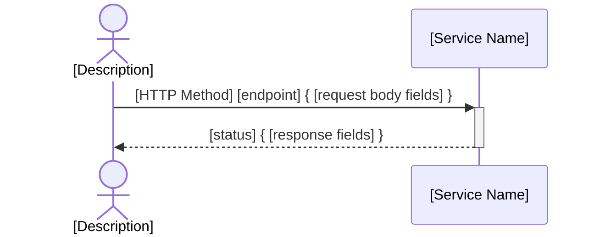
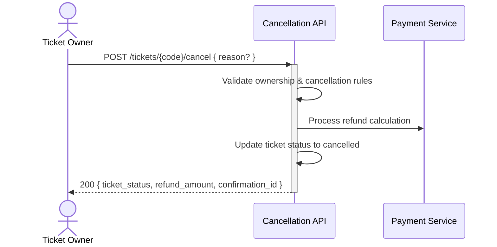

# Card Generation Template

This template provides the standard structure for creating technical cards from analyzed user stories.

## Card Structure

### Frontmatter (Required)
Every card must start with this frontmatter structure:

```yaml
---
card: "[Descriptive title of the card]"
slug: [kebab-case-slug]
team: "[A - Commerce | B - Fulfillment | C - Gate]"
oas_paths: ["/path1", "/path2"]
migrations: ["db/migrations/xxxx_description.sql"]
status: "[Ready | In Progress | PR | Done]"
readiness: "[prototype | mvp | production]"
branch: "[git-branch-name]"
pr: "[PR-URL or empty]"
newman_report: "reports/newman/[card-slug].json"
last_update: "[YYYY-MM-DDTHH:mm:ss+TZ]"
related_stories: ["US-XXX", "US-YYY"]
---
```

### Card Content Structure

```markdown
## Status & Telemetry
- Status: [Current status]
- Readiness: [prototype/mvp/production]
- Spec Paths: [API paths this card owns]
- Migrations: [List of database changes]
- Newman: [Test status] • [Report path]
- Last Update: [ISO timestamp]

## 0) Prerequisites
[List dependencies on other cards, external services, or setup requirements]

## 1) API Sequence (Context)


## 2) Contract (OAS 3.0.3)
[OpenAPI specification fragment for this card's endpoints]

## 3) Invariants
[Business rules that must always be true]

## 4) Validations, Idempotency & Concurrency
[Input validation, error handling, and concurrency considerations]

## 5) Rules & Writes (TX)
[Step-by-step implementation logic with transaction boundaries]

## 6) Data Impact & Transactions
[Database schema changes and migration details]

## 7) Observability
[Logging events, metrics, and monitoring requirements]

## 8) Acceptance — Given / When / Then
[Testable acceptance criteria in BDD format]

## 9) Postman Coverage
[Newman test scenarios to implement]
```

## Team Assignment Guidelines

### Team A - Commerce
**Owns:** Orders, payments, catalog, pricing, inventory
**Examples:** order-create, wallyt-payment, catalog-endpoint
**Pattern:** Financial transactions, business logic

### Team B - Fulfillment
**Owns:** Tickets, entitlements, user experience, QR codes
**Examples:** my-tickets, qr-generation-api, miniprogram-order
**Pattern:** User-facing functionality, ticket lifecycle

### Team C - Gate
**Owns:** Redemption, operators, validation, scanning
**Examples:** venue-enhanced-scanning, operators-login, venue-analytics-reporting
**Pattern:** Physical redemption, operator tools

## Naming Conventions

### Card Slugs
- Use kebab-case: `my-tickets`, `wallyt-payment`
- Be descriptive but concise: `tickets-scan` not `scan`
- Include the main resource: `operators-login` not `login`

### API Paths
- Follow REST conventions: `/tickets/{id}/cancel`
- Use plural nouns: `/tickets` not `/ticket`
- Use clear actions: `/tickets/scan` not `/scan`

## OpenAPI Contract Template

```yaml
paths:
  /[resource]/[action]:
    [method]:
      tags: [ResourceManagement]
      summary: [Brief description]
      description: [Detailed description]
      parameters:
        - name: [param_name]
          in: [path|query|header]
          required: [true|false]
          schema:
            type: [string|integer|boolean]
      requestBody:
        required: [true|false]
        content:
          application/json:
            schema:
              $ref: '#/components/schemas/[RequestSchema]'
      responses:
        "200":
          description: [Success description]
          content:
            application/json:
              schema:
                $ref: '#/components/schemas/[ResponseSchema]'
        "400":
          description: Bad request
          content:
            application/json:
              schema:
                $ref: '#/components/schemas/Error'
        "401":
          description: Unauthorized
        "404":
          description: Resource not found
        "422":
          description: Validation failed
          content:
            application/json:
              schema:
                $ref: '#/components/schemas/ValidationError'
```

## Complete Example: ticket-cancellation Card

```yaml
---
card: "Ticket cancellation with refund calculation"
slug: ticket-cancellation
team: "B - Fulfillment"
oas_paths: ["/tickets/{code}/cancel"]
migrations: ["db/migrations/0008_ticket_cancellations.sql"]
status: "Ready"
readiness: "mvp"
branch: ""
pr: ""
newman_report: "reports/newman/ticket-cancellation.json"
last_update: "2025-10-20T16:00:00+0800"
related_stories: ["US-007"]
---

# Ticket cancellation with refund calculation — Dev Notes

## Status & Telemetry
- Status: Ready
- Readiness: mvp
- Spec Paths: /tickets/{code}/cancel
- Migrations: db/migrations/0008_ticket_cancellations.sql
- Newman: 0/0 • reports/newman/ticket-cancellation.json
- Last Update: 2025-10-20T16:00:00+0800

## 0) Prerequisites
- User authentication available (Bearer token)
- Ticket exists and user owns it
- Payment gateway refund API available
- Cancellation policy rules defined

## 1) API Sequence (Context)


## 2) Contract (OAS 3.0.3)
```yaml
paths:
  /tickets/{code}/cancel:
    post:
      tags: [TicketManagement]
      summary: Cancel ticket and process refund
      parameters:
        - name: code
          in: path
          required: true
          schema:
            type: string
      requestBody:
        required: false
        content:
          application/json:
            schema:
              type: object
              properties:
                reason:
                  type: string
                  description: Optional cancellation reason
      responses:
        "200":
          description: Ticket cancelled successfully
          content:
            application/json:
              schema:
                type: object
                properties:
                  ticket_status:
                    type: string
                    enum: [cancelled]
                  refund_amount:
                    type: number
                    format: decimal
                  confirmation_id:
                    type: string
        "401":
          description: Unauthorized - invalid or missing token
        "404":
          description: Ticket not found or not owned by user
        "409":
          description: Ticket cannot be cancelled (already used/expired)
        "422":
          description: Cancellation policy violation
```

## 3) Invariants
- Only ticket owner can cancel their tickets
- Tickets with redemptions cannot be cancelled
- Refund amount follows cancellation policy (24h rule)
- Cancelled tickets cannot be reactivated

## 4) Validations, Idempotency & Concurrency
- Verify ticket ownership via user token
- Check ticket status is 'active' (not expired/redeemed/cancelled)
- Calculate refund based on time since purchase and policy
- Prevent double cancellation (409 if already cancelled)

## 5) Rules & Writes (TX)
1) Begin transaction
2) Load ticket with FOR UPDATE lock
3) Validate user owns ticket and ticket is cancellable
4) Calculate refund amount based on policy
5) Update ticket status to 'cancelled', set cancelled_at timestamp
6) Insert cancellation record with refund details
7) Trigger refund processing (async)
8) Commit transaction
9) Return success response with refund info

## 6) Data Impact & Transactions
**Migration:** `db/migrations/0008_ticket_cancellations.sql`
- Add `cancelled_at`, `cancellation_reason` to tickets table
- Create `cancellations` table for audit trail
- Add indexes for performance

## 7) Observability
- Log `ticket.cancellation.requested {ticket_code, user_id}`
- Log `ticket.cancellation.success {refund_amount}`
- Log `ticket.cancellation.failed {reason}`
- Metric `ticket.cancellations.count`

## 8) Acceptance — Given / When / Then
**Given** a user owns an active ticket purchased >24h ago
**When** they POST to `/tickets/{code}/cancel`
**Then** ticket status becomes 'cancelled' and full refund is processed

**Given** a ticket has been redeemed
**When** user attempts cancellation
**Then** 409 Conflict returned with appropriate error message

## 9) Postman Coverage
- Happy path: Cancel unused ticket, verify refund amount
- Edge case: Attempt to cancel already used ticket → 409
- Edge case: Attempt to cancel someone else's ticket → 404
- Policy test: Cancel <24h → partial refund, >24h → full refund
```

## Usage Guidelines for Fresh AI

1. **Start with Story Analysis**: Use the Story Analysis Template first
2. **Choose Team Assignment**: Based on the functionality area
3. **Fill Frontmatter**: Use current timestamp for last_update
4. **Write Clear Contracts**: Focus on request/response formats
5. **Define Business Rules**: Make invariants testable
6. **Plan Data Changes**: Consider existing schema and migrations
7. **Add Observability**: Follow existing logging patterns
8. **Write Acceptance Criteria**: Make them specific and testable

This template ensures consistency with existing cards and provides everything needed for implementation and integration proof creation.